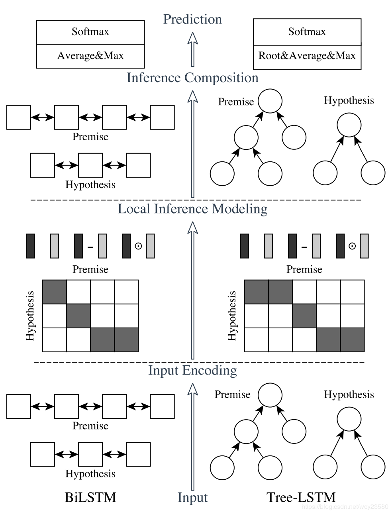

# Enhanced LSTM for Natural Language Inference(ESIM)

## 1. 模型结构

ESIM主要分为三部分：**input encoding**，**local inference modeling** 和 **inference composition**。如上图所示，ESIM 是左边一部分。

### 1.1 input encoding

​	Input Encoding 就是输入两句话分别接 embeding + BiLSTM，使用复用的双向 LSTM（BiLSTM）单元分别对 p （前提 Premise）和 h （假设 Hypothesis ）进行编码，得到 a 和 b。
$$
\overline{a}_i = BiLSTM(a, i), \forall i \in [1,2,\cdots,l_a]\\
\overline{b}_i = BiLSTM(b, i), \forall i \in [1,2,\cdots,l_b]
$$
​	使用 BiLSTM 可以学习如何表示一句话中的 word 和它上下文的关系，我们也可以理解成这是 在 word embedding 之后，在当前的语境下重新编码，得到新的 embeding 向量。

### 1.2 local inference encoding

​	使用 Decomposable Attention 分别对 p 和 h 做权重计算，得到 attention 权重 $$\hat{a};\hat{b}$$
$$
\hat{a}_i = \sum^{l_b}_{j=1}\frac{exp_{ij}}{\sum^{l_b}_{k=1}exp(e_{ik})}\overline{b};\forall i \in [1,2,\cdots,l_a]\\
\hat{b}_i = \sum^{l_a}_{j=1}\frac{exp_{ij}}{\sum^{l_a}_{k=1}exp(e_{ik})}\overline{a};\forall i \in [1,2,\cdots,l_b]
$$
​	原文Decomposable Attention 在输入编码时候是直接用前馈神经网络对预训练的词向量做操作，这样会损失掉一些上下文信息，所以对其进行了改进。

### 1.3 inference composition

​	在 local inference 之后，进行 Enhancement of local inference information。这里的 enhancement 就是计算 $$ \hat{a}$$ 和 $$\overline{a}$$ 的差和乘积，体现了一种差异性吧，更利用后面的学习，$$ \hat{b} $$  和 $$\overline{b}$$ 也做差和乘积操作。之后再将四个进行聚合拼接操作。
$$
m_a = [\overline{a};\hat{a};\overline{a} - \hat{a};\overline{a}\otimes\hat{a}]\\
m_b = [\overline{b};\hat{b};\overline{b} - \hat{b};\overline{b}\otimes\hat{b}]
$$
​	最后做一个求最大值和均值的操作再将 p，h 拼接起来，过一下 BiLSTM，FFN 和 softmax 得到最终结果：
$$
v_{a,i} = BiLSTM(m_a, i)\\
v_{b,i} = BiLSTM(m_b, i)\\
v_{a,ave} = \sum^{l_a}_{i=1}\frac{v_{a,i}}{l_a}\\
v_{a,max} = {max}^{l_a}_{i=1}v_{a,i}\\
v_{b,ave} = \sum^{l_b}_{i=1}\frac{v_{b,i}}{l_b}\\
v_{b,max} = {max}^{l_b}_{i=1}v_{b,i}\\
v=[v_{a,ave};v_{a,max};v_{b,ave};v_{b,max}]
$$
