# NLP 问题处理思路

## 1. 数据处理

### 1.1. 句子定长

​	对于数据集中每个样本的句子进行判断，如果超过最大训练长度，则只截取前面的词汇；而如果句子长度小于最大长度，则采用"<pad>"等字符进行填充剩余空位。如下代码示例：

```python
# 将文本处理成定长
def preprocess(data, sequence_length=3000):
    """Process the characters of each sample to a fixed length."""
    res = []
    for sample in data:
        if len(sample) > sequence_length:
            sample = sample[:sequence_length - 1]
            res.append(sample)
        else:
            str_added = [PAD_STR] * (sequence_length - len(sample))
            sample += str_added
            res.append(sample)
    return res
```


### 1.2. 分词 or 分字

​	具体可以参考 4.2 章节工具介绍。

### 1.3. 词汇表

​	词汇表指的是将语料库中所有的单词放到一个集合中，集合中的单词按照一定规则进行排序且集合中单词都是唯一的。

​	一般词汇表的使用会结合两个字典进行使用，分别是 word_to_index_map 和 index_to_word_map：

其中 word_to_index_map ：将词转换为词汇表的对应单词的下标表示。一般用于将样本数据转换为数值表示方式，便于计算机进行计算；index_to_word_map：将下标表示的样本数据转换为对应单词表示。

### 1.4. 数据集划分

​	采用 sklearn 中的 train_test_split 放来可以进行划分。

```
from sklearn.model_selection import train_test_split

# test_size :为测试集所占的比例
X_train, X_test, y_train, y_test = train_test_split(X, y, test_size=0.33, random_state=42)
```


## 2. 词的表示方法

### 2.1. 词汇表中对应单词的下标位置

​	根据单词在词汇表的位置，并通过其位置的下标来表示该单词，举例如下：

**单词表**：[“中国”，“国家”，“主席”，“习近平”，“北京”，“钓鱼台”，“会见”，“到”，“访”，“日本”，“首相”]

**单词表的字典表示**：{“中国”：0，“国家”：1，“主席”：2，“习近平”：3，“北京”：4，“钓鱼台”：5，“会见”：6，“到”：7，“访”：8，“日本”：9，“首相”：10}

**每个单词的表示方式**：w(“中国”)：0； w(“国家”)：1，......，w(“首相”)：10

### 2.2. tf-idf

​	tf-idf 由词频（term frequency）和逆文档频率（inverse document frequency）相乘得到。它的大小与一个词的常见程度成反比。

**第一步：计算词频**：

​	**词频 = 某个词在文章中的出现次数**

其计算方式有两个：

1. 词频 = 某个词在文章中的出现次数 / 文章的总词数
2. 词频 = 某个词在文章中的出现次数 / 该文出现次数最多的词的出现次数

备注：词频的计算是针对一篇文章进行计算的。如上述公式中文章的总词数则是一篇文章中总的单词数量。

**第二步：计算逆文档频率**：

​	**逆文档频率 = log( 语料库的文档总数 / (包含该词的文档数 + 1) )**

备注：

1. 逆文档频率的计算需要一个语料库，用来模拟语言的使用环境；

 	2. 如果一个词越常见，那么分母就越大，逆文档频率就越小越接近 0；
 	3. 分母之所以要加 1，是为了避免分母为 0 （即所有文档都不包含该词）；
 	4. log 表示对得到的值取对数。

第三步：计算 TF-IDF

​	**TF-IDF = 词频（TF） * 逆文档频率（IDF）**

可以得到，TF-IDF 与一个词在文档中的出现次数成正比，与该词在整个语言中的出现次数成反比。

### 2.3. one-hot

​	独热编码（one-hot）是对于当前单词表中的单词使用衣蛾向量进行表达的简单方式。假如当前的单词表有10个不同的单词，那么独热编码使用10位的0、1数字来对该单词表进行编码，出现每个单词在对应的序号位标为1，否则为0。下面举例说明：

**单词表**：[“中国”，“国家”，“主席”，“习近平”，“北京”，“钓鱼台”，“会见”，“到”，“访”，“日本”，“首相”]

**每个单词的表示方式**：w(“中国”)：1000000000； w(“国家”)：01000000000，......，w(“首相”)：00000000001

### 2.4. 词袋模型

​	词袋模型是一种非常经典的文本表示。顾名思义，它就是将字符串视为一个“装满字符（词）的袋子”，袋子里的词语是随便摆放的。而两个词袋的相似程度就以它们重合的词及其相关分布进行判断。

​	将语料库中所有的词语放进一个袋子里，假设每个词语都是独立的，即不考虑其语法和语序的问题。这样就可以构成一个袋子，而这个袋子就是vocabulary。那么如何通过向量表示样本呢？有两种方式：

**第一种方式**：

​	通过向量表示样本的第一种方式：向量长度跟袋子（vocabulary）长度一样，而每个对应位置及样本中该单词出现次数，举例如下：

```
[Jane, wants, to, go, Shenzhen, Bob, Shanghai]

1、Jane wants to go to Shenzhen.# 表示如下

[1, 1, 2, 1, 1, 0, 0]
```

**第二种方式**：

​	通过向量表示样本的第二种方式：向量长度跟袋子（vocabulary）长度一样，而每个对应位置及样本中该单词是否出现，即 0、1 来表示。举例如下：

```
[Jane, wants, to, go, Shenzhen, Bob, Shanghai]

1、Jane wants to go to Shenzhen.# 表示如下

[1, 1, 1, 1, 1, 0, 0]
```

**第三种方式**：

​	通过 tf-idf 值替换原有的出现次数或下标值。先计算每个样本的每个单词的词频，再根据训练集计算每个单词在语料库中的逆文档频率，最后将每个样本中每个单词的词频跟对应在语料库的逆文档频率相乘，得出该样本中单词的表示值。

**优点**：

1. 简单方便，易使用；

**缺点**：

1. 没有考虑词法和词语顺序问题；
2. 词向量可能非常非常长。


### 2.7. 词-文档矩阵

​	定义：以单词为行，以文本为列的矩阵，反映一个文本中以 0、1 编码表示的所有单词。具体数值代表词汇表中某个单词在样本中是否出现。举例如下：

**英文文档**：直接调用 sklearn 的方法即可：

```Python
# 对于英文文档列表，可以直接使用sklearn工具生成 WORD-DOCUMENT Matrix 
import pandas as pd
import numpy as np
from sklearn.feature_extraction.text import CountVectorizer
import matplotlib.pyplot as plt
from IPython.display import SVG, display

docs = ['this is a good book',
        'this cat is this good',
        'cat dog fight']
count_model = CountVectorizer(ngram_range=(1,1)) # default unigram model
X = count_model.fit_transform(docs)
```

**中文文档**：中文由于其特殊性，需要进行额外分词操作，需先分词，再通过空格对每个样本进行拼接后，再输入 sklearn 中。

分词操作：可以参考 4.2 章节中描述，如下采用 jieba 进行示例展示：

```Python
import jieba
import re

# 主动初始化jieba分词包
jieba.initialize()  
# 简单示例
documents = [u'独热编码是对于当前单词表中的单词使用1个向量进行表达的简单方式，独热编码有自身的缺点和有点。', 
             u'假如当前的单词表有10个不同的单词，并且每个单词都不一样', 
             u'研究者探索了可以解决存储效率和单词之间关系问题的方法', 
             u'独热编码虽然简单']

documents_after = []

# 第一步先将中文词切分开，每个原有中文字符串组成一个单独的列表
documents_after = [[w for w in jieba.cut(s)] for s in documents]
# 第二部用空格将单独列表中的中文词元素连接成一个带空格的字符串，从而可以模仿英文的操作
documents_after = [ ' '.join(s) for s in documents_after]

# 再使用sklearn模块生成word-document矩阵
cn_count_model = CountVectorizer(ngram_range=(1,1), lowercase=False)
# default unigram #model, 缺省要小写变换在中文中不适用，会报错
cnX = cn_count_model.fit_transform(documents_after)

print(u'词-文矩阵：')
print(cnX.todense())
print('\n')

print(u'词-文矩阵对应的特征索引号（矩阵列的序号）：')
print(cn_count_model.vocabulary_)
print('\n')

# 将词-文矩阵的列打上标签：
voc_df=pd.DataFrame.from_dict(cn_count_model.vocabulary_, columns=['idx'], orient='index').sort_values(by=['idx'])
cols = list(voc_df.index)
print('带标签的词-文矩阵:')
pd.DataFrame(cnX.todense(), columns=cols)
```


### 2.6. SVD 共生矩阵

#### 2.6.1. 第一步：生成共生矩阵

​	滑动窗口的共生矩阵因为包含了两个单词在一定相邻距离上同时出现的频次，因此反映了单词之间的相关程度。如果不考虑窗口大小，从而在全局考虑共生矩阵的生成的化，只需要使用词-文矩阵的矩阵乘积即可，下面展示生成共生矩阵的两种方式：

**第一种方式：窗口大小为 1**；

```python
def cn_string_to_words(documents):
    # 第一步先将中文词切分开，每个原有中文字符串组成一个单独的列表
    documents_after = [[w for w in jieba.cut(s)] for s in documents]
    # 第二部用空格将单独列表中的中文词元素连接成一个带空格的字符串，从而可以模仿英文的操作
    documents_after = [ ' '.join(s) for s in documents_after]
    return documents_after

documents = [u'独热编码是对于当前单词表中的单词使用1个向量进行表达的简单方式，独热编码有自身的缺点和有点。', 
             u'假如当前的单词表有10个不同的单词，并且每个单词都不一样', 
             u'研究者探索了可以解决存储效率和单词之间关系问题的方法', 
             u'独热编码虽然简单']
documents_after  = cn_string_to_words(documents)

# 再使用sklearn模块生成word-document矩阵
min_n = 1
max_n = 1
cn_count_model = CountVectorizer(ngram_range=(min_n, max_n), lowercase=False) # 缺省为 unigram 模型
cnX = cn_count_model.fit_transform(documents_after)

print(u'共生矩阵：')
#cnXdense = cnX.todense()
#%time XTX = np.dot(cnXdense.T, cnXdense)
#%time XTX = cnX.T * cnX
start_time = time.time()
XTX = cnX.T * cnX
end_time = time.time()
print("time:", end_time - start_time)
print(XTX.todense(), '\n')

print(u'词-文矩阵对应的特征索引号（矩阵列的序号）：')
print(cn_count_model.vocabulary_)
print('\n')

# 将共生矩阵的列打上标签：
voc_df=pd.DataFrame.from_dict(cn_count_model.vocabulary_, columns=['idx'], orient='index').sort_values(by=['idx'])
cols = list(voc_df.index)
print('带标签的共生矩阵:')
pd.DataFrame(XTX.todense(), columns=cols, index=cols)
```

**第二种方式：自定义窗口大小**；

```python
# 将样本数据转换为词汇表的下标位置进行表示
vocabulary = cn_count_model.vocabulary_
V = len(vocabulary)
documents_index = [[vocabulary[word]+1 for word in doc.split(' ') if word in vocabulary.keys()] for doc in documents_after]
print(documents_index)

from keras.preprocessing import sequence
from keras.utils import np_utils
def generate_cooccurancemat(corpus, window_size, V):
    maxlen = window_size*2
    result = np.zeros([V, V], dtype=int)    
    for words in corpus:
        L = len(words)
        for index, word in enumerate(words):
            #获取index对应的近邻词列表
            contexts = []                 
            s = index - window_size
            e = index + window_size + 1            
            contexts.append([words[i] for i in range(s, e) if 0 <= i < L and i != index])
            x = sequence.pad_sequences(contexts, maxlen=maxlen)
            #对于该共生组合，对于其相应矩阵位置计数+1
            for k in x[0]:
                if k!=0:
                    result[word-1, k-1] += 1                        
    return result

cooccurancemat = generate_cooccurancemat(documents_index, 3, V)
pd.DataFrame(cooccurancemat, columns=cols, index=cols)
```

#### 2.6.2. 第二步：将共生矩阵进行 SVD 分解

```python
# 新生成的tfidfX是我们需要的TFIDF矩阵
cn_tf_model = TfidfVectorizer(lowercase=False, stop_words = stopword)
tfidfX = cn_tf_model.fit_transform(documents2_after)

from sklearn.decomposition import TruncatedSVD
svd = TruncatedSVD(n_components=10, n_iter=10, random_state=4992)
# 这是用 svd 对共生矩阵进行分解
svd0=svd.fit(cnX.T)
u0 = svd0.transform(cnX.T)
# 这是用 svd 对用 tf-idf 表示的 词-文矩阵 进行分解
svd1=svd.fit(tfidfX.T)
u1 = svd1.transform(tfidfX.T)
```


### 2.7. word2vec

​	word2vec 是从大量文本语料中以无监督的方式学习语义知识的一种模型，被大量地用在自然语言处理中。word2vec 其实就是通过学习文本来用词向量的方式表征词的语义信息，即通过一个嵌入空间使得语义上相似的单词在该空间内举例很近。

​	word2vec 之所以现在这么流行，不同于之前 word embedding 方法，它能够自动实现：1）单词语义相似性的度量；2）词汇的语义的类比。

​	Word2Vec 模型中，主要有 Skip-Gram 和 CBOW 两种模型，从直观上理解，Skip-Gram 是给定 input word 来预测上下文。而 CBOW 是给定上下文，来预测input word。


​	Word2Vec模型实际上分为了两个部分，**第一部分为建立模型，第二部分是通过模型获取嵌入词向量**。Word2Vec的整个建模过程实际上与自编码器（auto-encoder）的思想很相似，即先基于训练数据构建一个神经网络，当这个模型训练好以后，我们并不会用这个训练好的模型处理新的任务，我们真正需要的是这个模型通过训练数据所学得的参数，例如隐层的权重矩阵——后面我们将会看到这些权重在Word2Vec中实际上就是我们试图去学习的“word vectors”。基于训练数据建模的过程，我们给它一个名字叫“Fake Task”，意味着建模并不是我们最终的目的。

> 上面提到的这种方法实际上会在无监督特征学习（unsupervised feature learning）中见到，最常见的就是自编码器（auto-encoder）：通过在隐层将输入进行编码压缩，继而在输出层将数据解码恢复初始状态，训练完成后，我们会将输出层“砍掉”，仅保留隐层。

#### 2.7.1. skip-gram

##### 2.7.1.1. 如何训练神经网络

假如我们有一个句子**“The dog barked at the mailman”**。

- 首先我们选句子中间的一个词作为我们的输入词，例如我们选取“dog”作为input word；
- 有了 input word 以后，我们再定义一个叫做 skip_window 的参数，它代表着我们从当前 input word 的一侧（左边或右边）选取词的数量。如果我们设置 skip_window=2，那么我们最终获得窗口中的词（包括 input word 在内）就是**['The', 'dog'，'barked', 'at']**。skip_window=2 代表着选取左 input word 左侧2个词和右侧2个词进入我们的窗口，所以整个窗口大小 span=2x2=4。另一个参数叫 num_skips，它代表着我们从整个窗口中选取多少个不同的词作为我们的 output word，当 skip_window=2，num_skips=2 时，我们将会得到两组 **(input word, output word)** 形式的训练数据，即 **('dog', 'barked')**，**('dog', 'the')**。
- 神经网络基于这些训练数据将会输出一个概率分布，这个概率代表着我们的词典中的每个词是 output word 的可能性。这句话有点绕，我们来看个栗子。第二步中我们在设置 skip_window 和 num_skips=2 的情况下获得了两组训练数据。假如我们先拿一组数据 **('dog', 'barked')** 来训练神经网络，那么模型通过学习这个训练样本，会告诉我们词汇表中每个单词是 “barked” 的概率大小。

**模型的输出概率代表着到我们词典中每个词有多大可能性跟input word同时出现**。下面的图中给出了一些我们的训练样本的例子。我们选定句子**“The quick brown fox jumps over lazy dog”**，设定我们的窗口大小为2（window_size=2），也就是说我们仅选输入词前后各两个词和输入词进行组合。下图中，蓝色代表input word，方框内代表位于窗口内的单词。

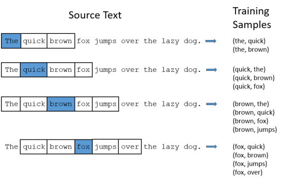

##### 2.7.1.2. 模型细节

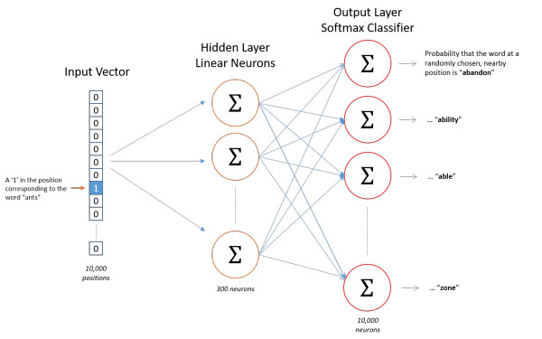

​	skip-gram 的训练模型共分三层，分别为输入层、隐层和输出层，下面分成三个部分进行讲解。

###### 2.7.1.2.1. 输入层

1. **如何表示单词**：基于训练文档（语料库）来构建我们自己的词汇表（vocabulary）再对单词进行 one-hot 编码；

   > 假设从我们的训练文档中抽取出10000个唯一不重复的单词组成词汇表。我们对这10000个单词进行one-hot编码，得到的每个单词都是一个10000维的向量，向量每个维度的值只有0或者1，假如单词ants在词汇表中的出现位置为第3个，那么ants的向量就是一个第三维度取值为1，其他维都为0的10000维的向量（ants=[0, 0, 1, 0, ..., 0]）。

2. 模型的输入如果为一个10000维的向量，那么输出也是一个10000维度（词汇表的大小）的向量，它包含了10000个概率，每一个概率代表着当前词是输入样本中output word的概率大小。

3. 我们基于成对的单词来对神经网络进行训练，训练样本是 ( input word, output word ) 这样的单词对，input word和output word都是one-hot编码的向量。最终模型的输出是一个概率分布。

###### 2.7.1.2.2. 隐层

1. 隐层没有使用任何激活函数；
2. 如果我们现在想用300个特征来表示一个单词（即每个词可以被表示为300维的向量）。那么隐层的权重矩阵应该为10000行，300列（隐层有300个结点）；
3. 下面图片是不同角度下输入层-隐层的权重矩阵的解释：左图中每一列代表一个10000维的词向量和隐层单个神经元连接的权重向量；右图中每一行实际上代表了每个单词的词向量。

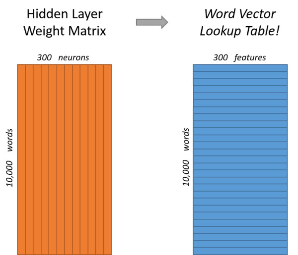

4. 10000维下的矩阵运算是十分低效的。为了有效地进行计算，这种稀疏状态下不会进行矩阵乘法计算，可以看到矩阵的计算的结果实际上是矩阵对应的向量中值为1 的索引，这样模型中的隐层权重矩阵便成了一个“查找表”，进行矩阵运算，直接去查输入向量中取值为1的维度下对应的那些权重值。
5. 隐层的输出就是每个输入单词的“嵌入词向量”。

###### 2.7.1.2.3. 输出层

1. 经过神经网络隐层的计算，单词向量从一个1 x 10000 的向量变成 1x 300 的向量，再被输入到输出层中计算；
2. 输出层就是一个softmax回归分类器，它的每个结点将会输出一个 0-1 之间的值（概率），这些所有输出层神经元结点的概率之和为1：

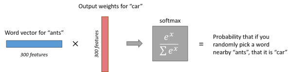

#### 2.7.2. CBOW

​	CBOW（Continuous Bag-Of-Words Model）为连续词袋模型。跟 skip-gram 互为镜像，其训练过程是通过上下文单词预测对应的单词。示例图如下：

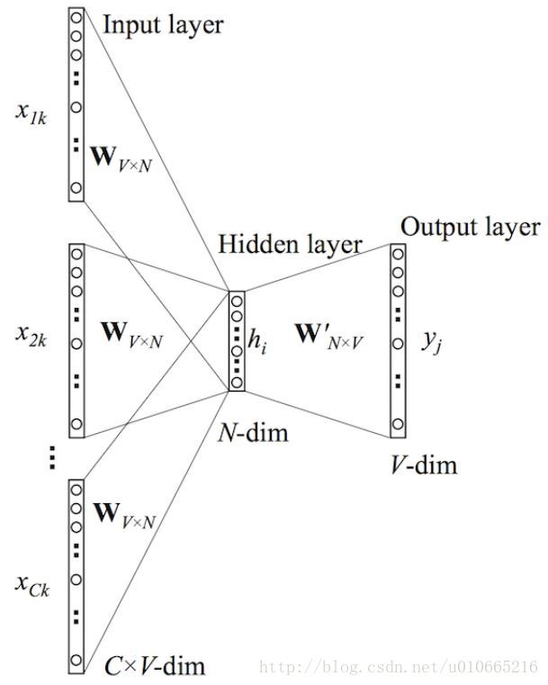

##### 2.7.2.1. 前向传播

​	在上图中，该模型的输入输出与 skip-gram 模型的输入输出是相反的。这里输入层是由 one-hot 编码的输入上下文 **{x1, …, xC}** 组成，其中窗口大小为 **C**，词汇表大小为 **V**。隐藏层是N维的向量。最后输出层是也被 one-hot编码的输出单词 y。被 one-hot 编码的输入向量通过一个 **V×N** 维的权重矩阵 **W** 连接到隐藏层；隐藏层通过一个 **N×V** 的权重矩阵 **W′** 连接到输出层。 

1. 第一步计算隐藏层 h 的输出，如下：

$$
h = \frac{1}{C} W·(\sum_{i-1}^C{x_i})
$$

​		该输出就是输入向量的加权平均。这里的隐藏层与 skip-gram 的隐藏层明显不同。

2. 第二步就是计算在输出层每个结点的输入：

$$
u_j = v'^T_{wj}·h
$$

​		其中 v'^T_{wj} 就是输出矩阵 W’ 的第 j 列。

3. 最后我们计算输出层的输出，输出 yj ，如下：

$$
y_{c,j}=p(w_{y,j}|w_1,...w_c)=\frac{exp(u_j)}{\sum_{j'=1}^V exp(u'j)}
$$


##### 2.7.2.2. 通过反向传播和随机梯度下降来学习权重

​	在学习权重矩阵 **W** 与 **W′** 过程中，我们可以给这些权重赋一个随机值来初始化。然后按序训练样本，逐个观察输出与真实值之间的误差，并计算这些误差的梯度。并在梯度方向纠正权重矩阵。这种方法被称为随机梯度下降。但这个衍生出来的方法叫做反向传播误差算法。 

1. 定义损失函数，这个损失函数就是给定输入上下文的输出单词的条件概率，一般都是取对数，如下所示：

$$
E = -log(w_o|W_I) 
= -v^T_{wo}·h - log\sum^V_{j'=1}exp(v^T_{w_{j'}}·h)
$$

2. 接下来对上面的概率求导，具体推导过程可以去看 BP 算法，我们得出输出权重矩阵 W‘ 的更新规则：

$$
w'^{new} = w'^{old}_{ij} - \eta · (y_j - t_j)·h_i
$$

3. 同理权重 **W** 的更新规则如下：

$$
w^{(new)} = w^{(old)}_{ij} - \eta·\frac{1}{C}·EH
$$

##### 2.7.2.3 tensorflow 实现 CBOW

1. 生成符合 CBOW 的 batch

```python
def generate_batch(batch_size, cbow_window):
    global data_index
    assert cbow_window % 2 == 1
    span = 2 * cbow_window + 1
    # 去除中心word: span - 1
    batch = np.ndarray(shape=(batch_size, span - 1), dtype=np.int32)
    labels = np.ndarray(shape=(batch_size, 1), dtype=np.int32)

    buffer = collections.deque(maxlen=span)
    for _ in range(span):
        buffer.append(data[data_index])
        # 循环选取 data中数据，到尾部则从头开始
        data_index = (data_index + 1) % len(data)
    
    for i in range(batch_size):
        # target at the center of span
        target = cbow_window
        # 仅仅需要知道context(word)而不需要word
        target_to_avoid = [cbow_window]

        col_idx = 0
        for j in range(span):
            # 略过中心元素 word
            if j == span // 2:
                continue
            batch[i, col_idx] = buffer[j]
            col_idx += 1
        labels[i, 0] = buffer[target]
        # 更新 buffer
        buffer.append(data[data_index])
        data_index = (data_index + 1) % len(data)

    assert batch_size[0] == batch_size
    assert batch_size[1] == span - 1
    return batch, labels
```

2. 建立模型

- 修改placeholder的形状
- 对上下文的词向量进行评价

```python
# 迭代步数
num_steps = 100001

if __name__ == '__main__':
    batch_size = 128
    embedding_size = 128 # Dimension of the embedding vector.
    cbow_window = 1 # How many words to consider left and right.
    num_skips = 2 # How many times to reuse an input to generate a label.
    # We pick a random validation set to sample nearest neighbors. here we limit the
    # validation samples to the words that have a low numeric ID, which by
    # construction are also the most frequent.
    valid_size = 16 # Random set of words to evaluate similarity on.
    valid_window = 100 # Only pick dev samples in the head of the distribution.
    # pick 16 samples from 100
    valid_examples = np.array(random.sample(range(valid_window), valid_size // 2))
    valid_examples = np.append(valid_examples, random.sample(range(1000, 1000+valid_window), valid_size // 2))
    num_sampled = 64 # Number of negative examples to sample.

    graph = tf.Graph()

    with graph.as_default(), tf.device('/cpu:0'):

        # Input data.
        train_dataset = tf.placeholder(tf.int32, shape=[batch_size,2 * cbow_window])
        train_labels = tf.placeholder(tf.int32, shape=[batch_size, 1])
        valid_dataset = tf.constant(valid_examples, dtype=tf.int32)

        # Variables.
        # embedding, vector for each word in the vocabulary
        embeddings = tf.Variable(tf.random_uniform([vocabulary_size, embedding_size], -1.0, 1.0))
        nce_weights = tf.Variable(tf.truncated_normal([vocabulary_size, embedding_size],
                         stddev=1.0 / math.sqrt(embedding_size)))
        nce_biases = tf.Variable(tf.zeros([vocabulary_size]))

        # Model.
        # Look up embeddings for inputs.
        # this might efficiently find the embeddings for given ids (traind dataset)
        # manually doing this might not be efficient given there are 50000 entries in embeddings
        embeds = None
        for i in range(2 * cbow_window):
            embedding_i = tf.nn.embedding_lookup(embeddings, train_dataset[:,i])
            print('embedding %d shape: %s'%(i, embedding_i.get_shape().as_list()))
            emb_x,emb_y = embedding_i.get_shape().as_list()
            if embeds is None:
                embeds = tf.reshape(embedding_i, [emb_x,emb_y,1])
            else:
                embeds = tf.concat([embeds, tf.reshape(embedding_i, [emb_x, emb_y,1])], 2)

        assert embeds.get_shape().as_list()[2] == 2 * cbow_window
        print("Concat embedding size: %s"%embeds.get_shape().as_list())
        avg_embed =  tf.reduce_mean(embeds, 2, keep_dims=False)
        print("Avg embedding size: %s"%avg_embed.get_shape().as_list())

        loss = tf.reduce_mean(tf.nn.nce_loss(nce_weights, nce_biases,
                               labels=train_labels,
                               inputs=avg_embed,
                               num_sampled=num_sampled,
                               num_classes=vocabulary_size))

        # Optimizer.
        # Note: The optimizer will optimize the softmax_weights AND the embeddings.
        # This is because the embeddings are defined as a variable quantity and the
        # optimizer's `minimize` method will by default modify all variable quantities
        # that contribute to the tensor it is passed.
        # See docs on `tf.train.Optimizer.minimize()` for more details.
        # Adagrad is required because there are too many things to optimize
        optimizer = tf.train.AdagradOptimizer(1.0).minimize(loss)

        # Compute the similarity between minibatch examples and all embeddings.
        # We use the cosine distance:
        norm = tf.sqrt(tf.reduce_sum(tf.square(embeddings), 1, keep_dims=True))
        normalized_embeddings = embeddings / norm
        valid_embeddings = tf.nn.embedding_lookup(normalized_embeddings, valid_dataset)
        similarity = tf.matmul(valid_embeddings, tf.transpose(normalized_embeddings))

    with tf.Session(graph=graph) as session:
        tf.global_variables_initializer().run()
        print('Initialized')
        average_loss = 0
        for step in range(num_steps):
            batch_data, batch_labels = generate_batch(batch_size, cbow_window)
            feed_dict = {train_dataset : batch_data, train_labels : batch_labels}
            _, l = session.run([optimizer, loss], feed_dict=feed_dict)
            average_loss += l
            if step % 2000 == 0:
                if step > 0:
                    average_loss = average_loss / 2000
                    # The average loss is an estimate of the loss over the last 2000 batches.
                print('Average loss at step %d: %f' % (step, average_loss))
                average_loss = 0
            # note that this is expensive (~20% slowdown if computed every 500 steps)
            if step % 10000 == 0:
                sim = similarity.eval()
                for i in range(valid_size):
                    valid_word = reverse_dictionary[valid_examples[i]]
                    top_k = 8 # number of nearest neighbors
                    nearest = (-sim[i, :]).argsort()[1:top_k+1]
                    log = 'Nearest to %s:' % valid_word
                    for k in range(top_k):
                        close_word = reverse_dictionary[nearest[k]]
                        log = '%s %s,' % (log, close_word)
                    print(log)
        final_embeddings = normalized_embeddings.eval()
```


## 3. 特征抽取

### 3.1. word2vec

​	详见 2.7 章节的介绍

### 3.2. NGram

​	这个 NGram 所构成特征数据就是 word2vec 模型所用来训练的特征数据。即根据 window_size 来确定上下文的范围，然后将上下文单词跟目标单词组成单词对，而这由语句所生成的所有单词对，即该语句的 NGram 特征数据。

### 3.3. ELMO

#### 3.3.1 ELMO 产生的背景

​	ELMO 是 “Embedding from Language Models” 的简称，而提出 ELMO 论文题目是“Deep contextualized word representation” 更能体现该模型的精髓，而其精髓主要体现在 deep contextualized 这个短语，一个是 deep，而一个是 context，其中 context 更为关键。

​	在此之前的 word embedding 本质上是个静态的方式，所谓静态指的是训练好之后每个单词的表达就固定住了，以后使用的时候，不论新句子上下文单词是什么，这个单词的 word embedding 不会跟着上下文场景的变化而改变。举例说明：比如 bank 这个单词，事先学好的 word embedding 中混合了几种语义，而无论其上下文是 river 还是 money ，bank 这个单词的 word embedding 的内容都不会改变，而明显在不同上下文中，bank 这个单词所代表的语义不一样。

#### 3.3.2 ELMO 模型的定义

​	而 ELMO 的本质思想是：我事先用语言模型学好一个单词的 word embedding，此时多义词无法区分，不过这没有关系，在我实际使用 word embedding 的时候，单词已经具备了特定的上下文，这时 ELMO 模型可以根据上下文单词的语义去调整单词的 word embedding 表示，这样经过调整后的 word  embedding 更能表达在这个上下文中的具体含义，自然也就解决了多义词的问题了。ELMO 模型网结构示意图如下：

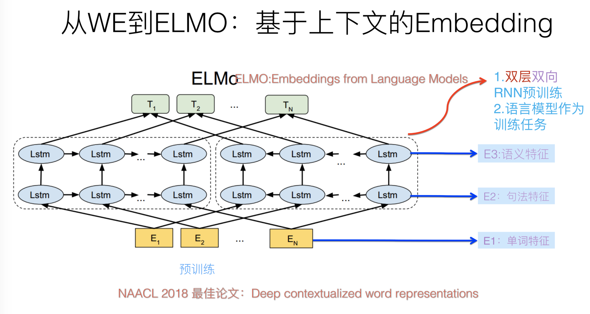

​	ELMO 采用了典型的两阶段过程，第一个阶段是利用语言模型进行预训练；第二个阶段时在做下游任务时，从预训练网络中提取对应单词的网络各层的 word embedding 作为新特征补充到下游任务重。上图展示的是预训练过程。

​	ELMO 模型采用了双层双向 LSTM，目前语言模型训练的任务目标是根据单词 W_i 的上下文去正确预测单词 W_i，W_i 之前的单词序列 Context-before 称为上文，之后的单词序列 Context-after 称为下文。图中左端的前向双层 LSTM 代表正方向编码器，输入的是从左到右顺序的除了预测单词外 W_i 的上文 Context-before ；右端的逆向双层 LSTM 代表反方向编码器，输入的是从右到左的逆序的句子下文 Context-after；每个编码器的深度都是两层 LSTM 叠加。

#### 3.3.3 ELMO 模型训练的结果

​	利用大量语料做语言模型训练任务就能预先训练好这个网络，如果训练好这个网络后，输入一个新句子 S_new，句子中每个单词都能得到对应的三个 Embedding：

- 最底层是单词的 word embedding
- 第一层双向 LSTM【即中间一层】对应单词位置的 Embedding，这层编码单词的句法信息更多一些
- 最上层双向 LSTM 中对应单词位置的 Embedding，这层编码单词的语义信息更多一些

ELMO 的预训练过程不仅仅学会单词的 word embedding，还学会了一个双层双向 LSTM 网络结构。

#### 3.3.4 ELMO 训练好之后如何使用

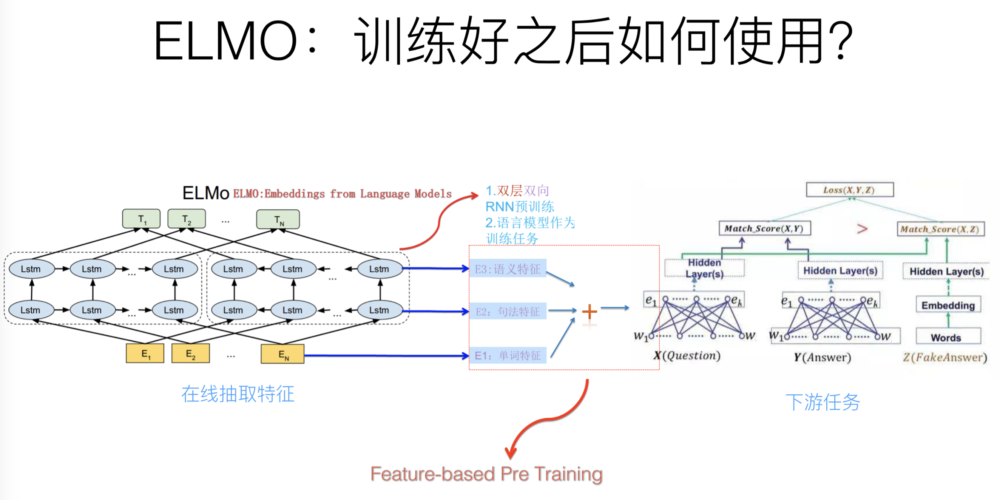

​	前面介绍的是 ELMO 的第一阶段：预训练阶段。那么预训练好网络结构后，如何给下游任务使用呢？上图展示了下游任务的使用过程，比如我们的下游任务仍然是QA问题，此时对于问句X，我们可以先将句子 X 作为预训练好的 ELMO 网络的输入，这样句子 X 中每个单词在 ELMO 网络中都能获得对应的三个 Embedding，之后给予这三个 embedding 中每一个 embedding 一个权重 a，这个权重可以学习得来，根据各自权重累加求和，将三个 embedding 整合成一个。然后将整合后的这个 Embedding 作为 X 句在自己任务的那个网络结构对应单词的输入，以此作为补充的新特征给下游任务使用。

​	对于上图所示下游任务QA中的回答句子Y来说也是如此处理。因为ELMO给下游提供的是每个单词的特征形式，所以这一类预训练的方法称为"Feature-based Pre-Training"。

#### 3.3.5 多义词问题解决了吗？

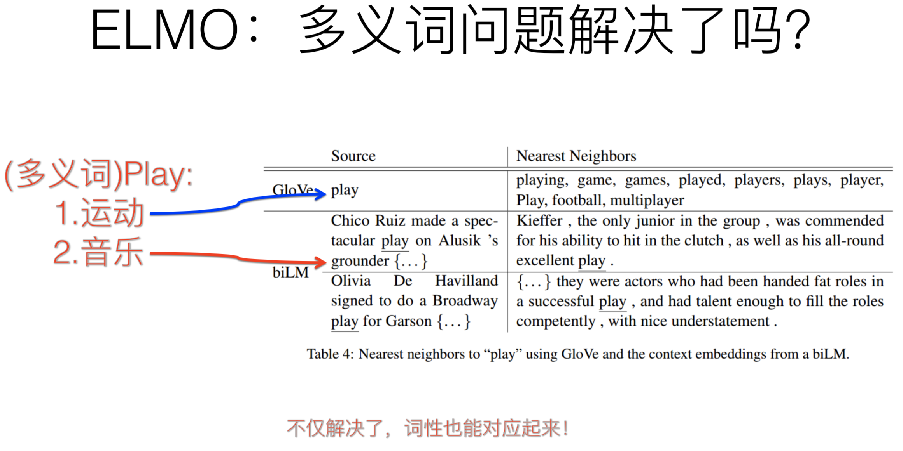

​	前面提到静态 word embedding 无法解决多义词的问题，那么 ELMO 引入上下文动态调整的 embedding 后多义词问题解决了吗？解决了，而且比我们期待的解决得还要好。

​	上图给的例子中，对于 Glove 训练出的 word embedding 来说，多义词比如 play，根据它的 embedding 找出的最接近的其它单词大多数集中在体育领域，这很明显是因为训练数据中包含 play 的句子中体育领域的数量明显占优导致；而使用 ELMO ，根据上下文动态调整后的 embedding 不仅能够找出对应的“演出”的相同语义的句子，而且还可以保障找出的句子中的 play 对应的词性也是相同的，这是超出期待之处。

​	之所以会这样，是因为我们上面提到过，第一层 LSTM 编码了很多句法信息，这在这里起到了重要作用。

#### 3.3.6 ELMO 效果如何？

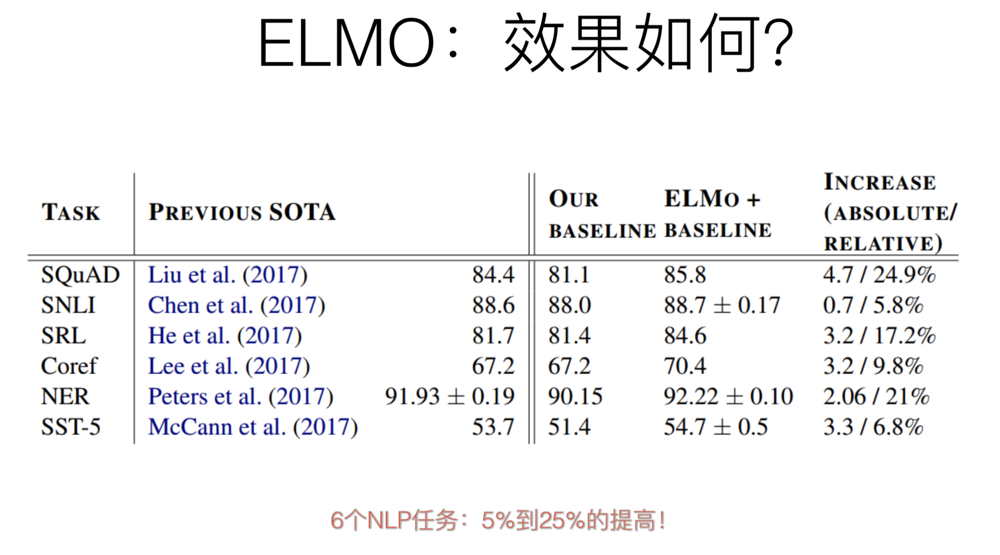

​	ELMO 经过这般操作，效果如何？实验效果见上图，6个NLP任务中性能都有幅度不同的提升，最高的提升达到了 25% 左右，而且这 6 个任务的覆盖范围比较广，包含句子语义关系判断、分类任务、阅读理解等多个领域，这说明其适用范围是非常广的，普适性强，这是一个非常好的优点。

### 3.4. GPT（transformer版ELMO）

#### 3.4.1 self-attention

​	Transformer 是个叠加的“自注意力机制（Self Attention）”构成的深度网络。其关键是自注意力机制（Self Attention）。所以我们主要介绍 self-attention。

​	当我们相对句子“The animal didn't cross the because it was too tired”中 “it” 这个词编码时，注意力机制的基本思想是认为这句话中每个词对 it 的语义均会有贡献。那怎么综合这些贡献呢，就是直接将每个词的 embedding 向量加权求和。所以关键的问题是如何得到每个词各自的权重，关系更近的词的权重更大。比如这句话中“The Animal”的权重就应该更大，它们的信息应该更多地编码到“it”中。自注意力机制得到权重的方法非常简单，就是两个词向量的内积。最终通过一个 softmax 将各个权重归一化。


​	在上图中，颜色的粗细代表该词的权重大小，权重由该词与“it” 的内积得到，最终通过一个 softmax 将各个权重归一化。自注意力机制其实就是最原始意义的卷积的思想的推广，因为卷积本身就是一种“加权求和”。

#### 3.4.2 GPT 定义

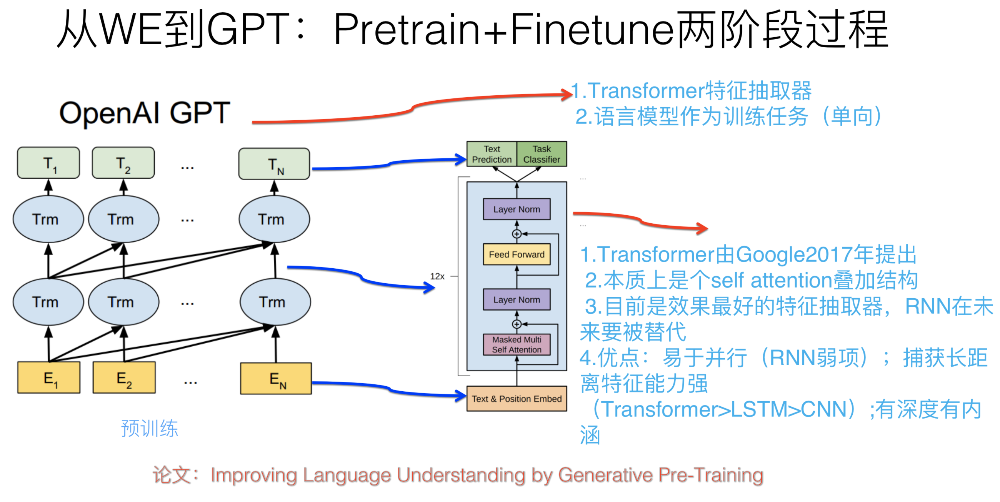

​	GPT 是 “Generative Pre-Training” 的简称，从名字看其含义是指的生成式的预训练。GPT 也采用两阶段过程，第一个阶段时利用语言模型进行预训练，第二阶段通过 Fine-tuning 的模式解决下游任务。上图展示了 GPT 的预训练过程，其实和 ELMO 是类似的，主要不同在于两点：首先，特征抽取器不是用的 RNN，而是用的 Transformer，上面提到过他的特征抽取能力要强于 RNN，这个选择很明显是很明智的；其次，GPT 的预训练虽然仍然是以语言模型作为目标任务，但是采用的是单向的语言模型，所谓 “单向” 的含义是指：语言模型训练的任务目标是根据 W_i 单词的上下文去正确预测单词 W_i ，W_i 之前的单词序列 Context-before 称为上文，之后的单词序列 Context-after 称为下文。ELMO 在做语言模型预训练的时候，预测单词 W_i 同时使用上文和下文，而 GPT 则只采用 W_i 这个单词的上文 Context-before 来进行预测，而抛开了下文。这个选择现在看不是个太好的选择，原因很简单，它没有把单词的下文融合近来，这限制了其在更多应用场景的效果，比如阅读理解这种任务，在做任务的时候是可以运行同事看到上文和下文一起做决策的。如果预训练时候不把单词的下文嵌入到 word embedding 中，是很吃亏，白白丢掉了很多信息。

上面讲的是 GPT 如何进行第一阶段的预训练，那么假设预训练好了网络模型，后面下游任务怎么用？它有自己的个性，和 ELMO 的方式大有不同。

#### 3.4.3 GPT：训练好之后如何使用？

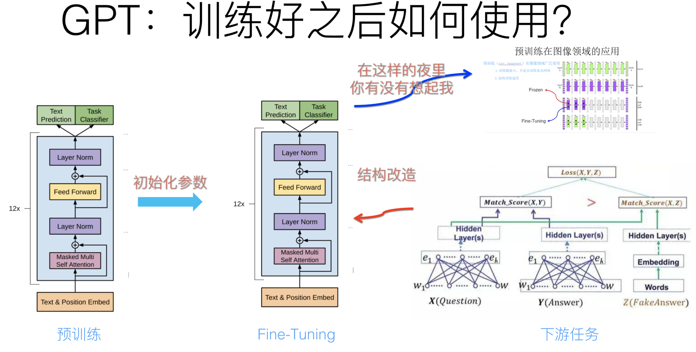

​	上图展示了 GPT 在第二阶段如何使用。首先，对于不同的下游任务来说，本来你可以任意设计自己的网络结构，现在不行了，你要向 GPT 的网络结构看齐，把任务的网络结构改造成和 GPT 的网络结构是一样的。然后在做下游任务的时候，利用第一步预训练好的参数初始化 GPT 的网络结构，这样通过预训练学到的语言学知识就被引入到你手头的任务里来了，这是非常好的事情。再次，你可以用手头的任务去巡逻这个网络，对网络参数进行 Fine-tuning，使得这个网络更适合解决手头的问题。

#### 3.4.4 GPT：如何改造下游任务

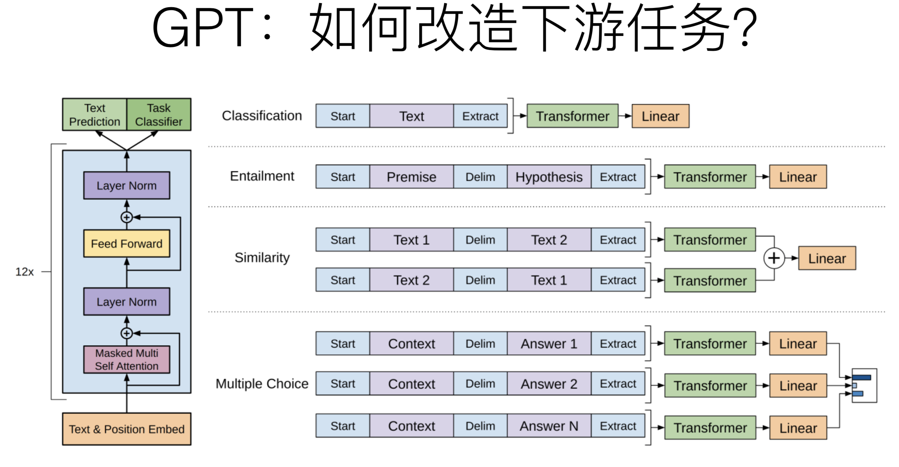

​	GPT 论文给了一个改造施工图如上，其实也很简单：

- 分类问题：不用怎么改造，加上一个起始和终结符号即可；
- 句子关系判断问题：比如 Entailment，两个句子中间再加个分隔符即可；
- 文本相似性判断问题：把两个句子顺序颠倒做出两个输入即可，这是为了告诉模型句子顺序不重要；
- 多项选择问题：多路输入，每一路把文章和答案选项拼接作为输入即可。

从上图可看出，这种改造还是很方便的，不同任务只需要在输入部分施工即可。

#### 3.4.5 GPT 效果如何？

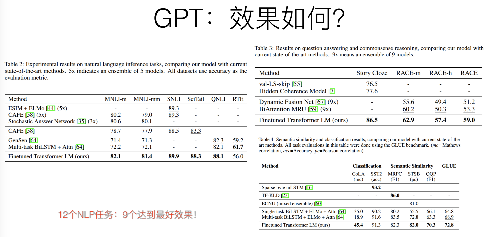

​	GPT 的效果是非常令人惊艳的，在12个任务里，9个达到了最好的效果，有些任务性能提升非常明显。


### 3.5. BERT（双层transformer）

​	BERT 的全称是 Bidirectional Encoder Representation from Transformers

#### 3.5.1 深层双向的 encoding

​	首先，它指出对上下文相关的词向量的学习上，先前的预训练模型还不够！虽然在下游有监督任务，encoding 的方式已经是花里胡哨非常充分了，深度双向 encoding 基本成了许多负责下游任务的标配（比如 MRC，dialogue）。但是在预训练模型上，先前的最先进模型也只是基于传统的语言模型来做，而传统的语言模型是单向的（数学上已经定义了），即
$$
p(s)=p(w0)\cdot p(w1|w0)\cdot p(w2|w1,w0)\cdot p(w3|w2, w1,w0) …p(wn|context)
$$
而且往往都很浅（想象一下 LSTM 堆三层就 train 不动了，就要上各种 trick 了），比如 ELMO。

​	另外，虽然 ELMO 有用双向 RNN 来做 encoding，但是这两个方向的 RNN 其实是分开训练的，只是在最后的 loss 层做了个简单相加。这样就导致对于每个方向上的单词来说，在被 encoding 的时候始终是看不到它另一侧的单词的。而显然句子中有的单词的语义会同时依赖于它左右两侧的某些词，仅仅从单方向做 encoding 是不能描述清楚的。

#### 3.5.2 Masked LM

​	顾名思义，Masked LM 就是说，我们不是像传统 LM 那样给定已经出现过的词，去预测下一个词，而是直接把整个句子的一部分词（随机选择）盖住（make it masked），这样模型不就可以放心的去做双向 encoding 了，然后就可以放心的让模型去预测这些盖住的词是啥。这个任务其实最开始叫做 cloze test （大概翻译成“完形填空测试”）。

​	这样显然会导致一些小问题。这样虽然可以放心的双向 encoding 了，但是这样在 encoding 时把这些盖住的标记也给 encoding 进去了。而这些 mask 标记在下游任务中是不存在的，那怎么办呢？对此，为了尽可能的把模型调教的忽略这些标记的影响，作者通过如下方式来告诉模型“这些是噪声是噪声！靠不住的！请忽略它们吧！”，对于一个被盖住的单词：

- 有 80% 的概率用 “[mask]” 标记来替换
- 有 10% 的概率用随机采样的一个单词来替换
- 有 10% 的概率不做替换（虽然不做替换，但是还是要预测哈）

#### 3.5.3 Encoder

​	在 encoder 的选择上，作者并没有用烂大街的 bi-lstm，而是使用了可以做的更深、具有更好并行性的 transformer encoder 来做。这样每个词位的词都可以无视方向和距离的直接把句子中的每个词都有机会 encoding 进来。另一方面我主观的感觉 Transformer 相比 lstm 更容易免受 mask 标记的影响，毕竟 self-attention 的过程完全可以把 mask 标记针对性的削弱匹配权重，但是 LSTM 中的输入门是如何看待 mask 标记的那就不得而知了。

​	但如果直接用 transformer encoder 显然不就丢失位置信息了吗？难不成这里也像 Transformer 原论文中那样搞了个让人怕怕的 sin、cos 函数编码位置？并没有，作者这里用简单粗暴的直接去训练了一个 position embedding。比如把句子截断到 50 的长度，那么我们就有 50 个位置，所以就有 50 个表征位置的单词，即从位置 0 一直到位置 49 ，然后给每个位置词一个随机初始化的词向量，再随它们训练去吧。另外，position，embedding 和 word embedding 的结合方式上，BERT 里选择了直接相加。

​	最后，在深度方面，最终 BERT 完全版的 encoder 丧心病狂的叠加了 24 层的 multi-head attention block（要知道对话里的 SOTA 模型的 DAM 才用了 3 层），而且每个 block 包含了 16 抽头、1024 隐单元。

#### 3.5.4 学习句子与句子对关系表示

​	像之前说的，在很多任务中，仅仅靠 encoding 是不足以完成任务的（这个只是学到了一堆 token 级的特征），还需要捕捉一些句子级的模式，来完成 SLI、QA、dialogue 等需要句子表示、句间交互与匹配的任务。对此，BERT 又引入了另一个极其重要却又极其轻量级的任务，来试图把这种模式也学习到。

#### 3.5.5 句子级负采样

​	word2vec 的一个精髓是引入了一个优雅的负采样任务来学习词向量（word-level representation），那么如果我们把这个负采样的过程给 generalize 到 sentence-level，这便是 BERT 学习 sentence-level representation 的关键。

​	BERT 这里跟 word2vec 做法类似，不过构造的是一个句子级的分类任务。即首先给定的一个句子（相当于 word2vec中给定context），它下一个句子即为正例（相当于 word2vec 中的正确词），随机采样一个句子作为负例（相当于 word2vec 中随机采样的词），然后在该 sentence-level 上来做二分类（即判断句子是当前句子的下一句还是噪声）。通过这个简单的句子级负采样任务，BERT 就可以像 word2vec 学习词表示那要轻松学到句子表示。

#### 3.5.6 句子级表示

​	BERT 这里并没有像下游监督任务中的普遍做法一样，在 encoding 的基础上再搞个全局池化之类的，它首先在每个 sequence （对于句子对任务来说是两个拼起来的句子，对于其他任务来说是一个句子）前面加了一个特殊的 token ，记为 [CLS]，如图：

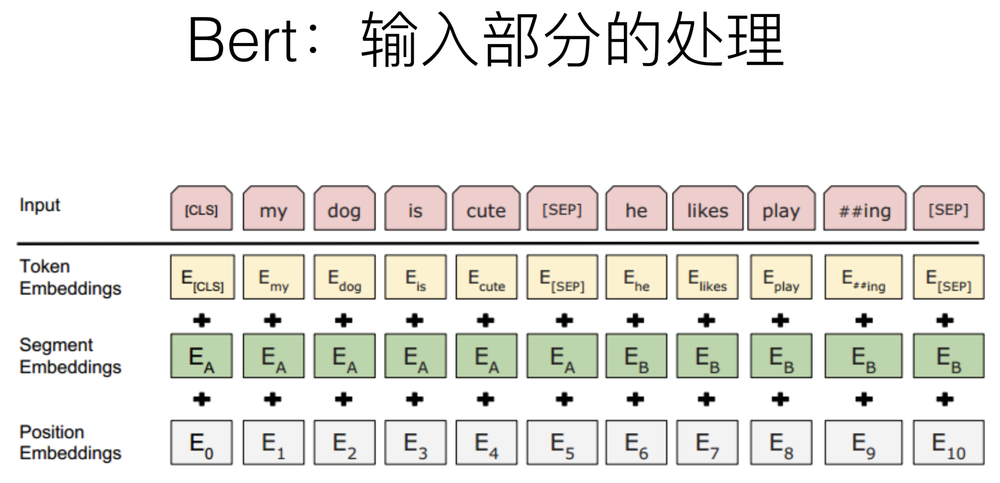

PS：这里的 [sep] 是句子之间的分隔符，BERT 同时支持学习句对的表示，这里是 [SEP] 便是为了区分句对的切割点。

​	然后让 encoder 对 [CLS] 进行深度 encoding，深度 encoding 的最高隐层即为整个句子/句对的表示。因为Transformer 是可以无视空间和距离的把全局信息 encoding 进每个位置的，而 [CLS] 作为句子/句对的表示是直接跟分类器的输出层连接的，因此其作为梯度反传路径上的“关卡”，当然会想办法学习到分类相关的上层特征啦。

​	另外，为了让模型能够区分里面的每个词是属于“左句子”还是“右句子”，作者这里引入了“segment embedding”的概念来区分句子。对句对来说，就用 embedding A 和 embedding B 来分别代表左句子和右句子；而对于句子来说，就只有 embedding A 啦。这个 embedding A 和 B 也是随模型训练出来的。

PS：这做法跟 position embedding 一样感觉简单粗暴，实在很费解为什么 BERT 用在“quora question pairs”这种理论上需要网络保持对称的任务上依然能 work ，心情复杂。

​	所以最终 BERT 每个 token 的表示由 token 原始的词向量 token embedding，前文提到的 position embedding  和这里的 segment embedding 三部分相加而成，如图。

#### 3.5.7 简洁到过分的下游任务接口

​	真正体现出 BERT 这个模型是龙骨级模型而不再是词向量的，就是其到各个下游任务的接口设计了，或者更好的叫迁移策略：

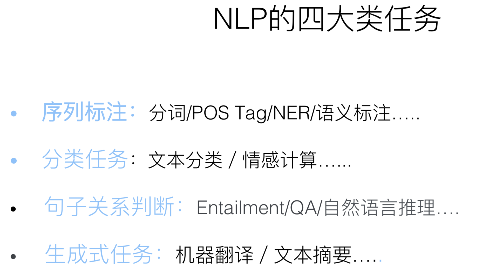

​	首先，既然句子和句子对的上层表示都得到了，那么当然对于文本分类任务和文本匹配任务（文本匹配其实也是一种文本分类任务，只不过输入是文本对）来说，只需要用得到的表示（encoder 在 [CLS] 词位的顶层输出）加上一层 MLP 就好了呀

​	既然文本都被深度双向 encoding 了，那么做序列标注任务就只需要加 softmax 输出层就好了呀，连 CRF 都不用了

​	在 spen 抽取式任务如 SQuAD 上，把深度 encoding 和深度 attention 这俩大礼包省掉就算了，甚至都敢直接把输出层的 pointer net 给丢掉了？直接像 DrQA 那样傲娇的用两个线性分类器分别输出 span 的起点和终点。

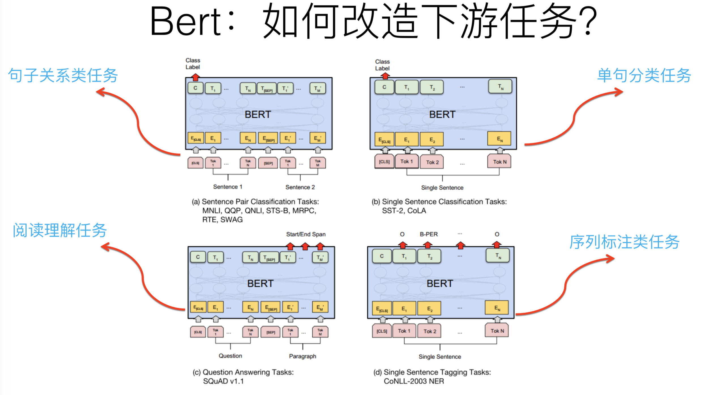

#### 3.5.8 BERT：效果如何

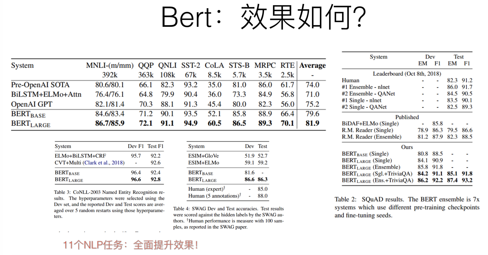


## 4. NLP 工具介绍

### 4.1. NLP 全系列处理框架 

|       名称       | 包含模块和下载地址                                           | 开发语言 |
| :--------------: | ------------------------------------------------------------ | :------: |
| 哈工大的 Ltp 3.X | 中文分词、词性标注、未登录词识别、句法分析、语义角色标注 <br>网址：https://github.com/HIT-SCIR/ltp/releases |   C++    |
|   Stanford NLP   | 中文分词、词性标注、未登录词识别、句法分析<br>网址：http://nlp.standord.edu/software/index.html |   Java   |
|     FudanNLP     | 中文分词、句法分析等<br>网址：http://code.google.com/p/fudannlp |   JAVA   |
|      HanLP       | 中文分词、句法分析等各类算法<br>网址：https://github.com/hankcs/HanLP |   JAVA   |

### 4.2. NLP 分词框架

|       名称       | 包含模块和下载地址                                           | 开发语言 |
| :--------------: | ------------------------------------------------------------ | :------: |
| ICTCLAS分词系统  | 具有里程碑意义的中文分词系统<br>网址：http://www.threedweb.cn/forum-2-1.html |   C++    |
| Ansj中文分词系统 | 中等规模的中文分词系统<br>网址：https://github.com/NLPchina/ansj_seg |   Java   |
|     结巴分词     | 小规模中文分词<br>网址：https://github.com/fxsjy/jieba       |  Python  |

