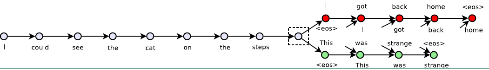
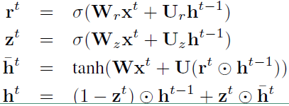
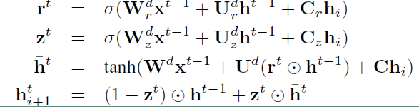

# skip-thought

## 1. 定义

​	skip-thought 模型结构借鉴来 skip-gram 的思想。在 skip-gram 中，是以中心的来预测上下文的词；在 skip-thought 中是以中心句子来预测上下文的句子。其数据结构可以用一个三元组表示（S_t-1, S_t, S_t+1）输入 S_t，输出为 S_t-1 和 S_t+1，具体模型架构如下：



## 2. 神经网络结构

​	skip-thought 模型的神经网络结构采用机器翻译中最常用的 Encoder-Decoder 架构，而在 Encoder-Decoder 架构中采用的模型是 GRU。因此在训练句子向量时同样要使用到词向量，编码器输出的结果为句子中最后一个词所输出的向量。具体模型实现的公式如下：

### 2.1. 编码阶段

​	

​	公式跟 GRU 是一样的，h_t 表示 t 时刻的隐层的输出结果。

### 2.2. 解码阶段

​	以 S_t 为例，S_t-1 相同：



其中 C_r、C_z、C 分别用来对重置门、更新门、隐层进行向量偏置的。

## 3. 词汇扩展

​	词汇扩展主要是为了解决 Decoder 模型中词汇不足的问题，具体做法就是：

1. 用 V_w2v 表示训练的词向量空间，用 V_nn 表示模型中词向量空间，V_w2v 是远远大于 V_nn 的
2. 引入一个矩阵 W 来构建一个映射函数：f : V_w2v -> V_nn，使得有 v' = W_v，其中 v 属于 V_w2v，v‘ 属于 V_nn；
3. 通过映射函数就可以将任何中 V_w2v 中的词映射到 V_nn 中


## 4. 用 tensor flow 实现 skip-thought

### 4.1 官方版本

​	skip-thought已经添加到Tensorflow models中，只需要安装TensorFlow models就可以使用，具体安装流程：

在GitHub上下载源码：git clone --recurse-submodules https://github.com/tensorflow/models

### 4.2 自己实现版本

#### 4.2.1 数据处理

1. 先对特殊符号进行处理，将整本小说按行分割成一个列表【数据集用的是网络小说：神墓】

```python
def _process_words(file_list):
        words = ''.join(file_list)
        vocab = sorted(set(words))
        mask = vocab[:110]+vocab[-57:]
        mark = ['!', ',', ':', ';', '?', '~', '…', '、', '。', '.', '？', '；', '：', '．', '，', '！']
        for m in mask:
            words = words.replace(m, '\\') if m in mark else words.replace(m, '')
        return words
```

2. 分割后的可能出现较多重复且意义不大的句子（如：啊、哈哈等），对模型产生噪声。这一步把高频的句子删除，用如下公式计算剔除该句子的概率：

$$
P(w_i) = 1 - \sqrt{\frac{t}{f(w_i)}}
$$

​	其中 f(w) 代表该句子出现的概率，t 为一个阈值。

```python
def _process_sentence_list(sentence_list, t=1e-5, threshold=0.5):
        sentence_count = Counter(sentence_list)
        total_count = len(sentence_list)
        # 计算句子频率
        sentence_freqs = {w: c / total_count for w, c in sentence_count.items()}
        # 计算被删除的概率
        prob_drop = {w: 1 - np.sqrt(t / sentence_freqs[w]) for w in sentence_count}
        # 剔除出现频率太高的句子
        sentence_list = [w for w in sentence_list if prob_drop[w] < threshold]
        return sentence_list
```

​	上述代码基于概率对句子进行采样，减少训练样本中的噪声。

3. 生成包含所有字的字典，添加特殊字符‘<PAD>’作为占位符，‘<UNK>’代替未在字典中出现的字，‘<GO>’代表句子的开始，'<EOS>'作为句子的结束。

```python
def _get_vocab(self):
        # 生成词字典
        special_words = ['<PAD>', '<UNK>', '<GO>', '<EOS>']
        words = ''.join(self.sentence_list)
        vocab = sorted(set(words))+special_words
        word_to_int = {w: i for i, w in enumerate(vocab)}
        int_to_word = {i: w for i, w in enumerate(vocab)}
        return vocab, word_to_int, int_to_word
```

​	基于上述代码可以将每一个句子转为数字向量。

5. Skip-thought vector 借鉴了 skip-gram vector 的思想，这里选取窗口的大小都规定为1，所以其实是取句子的上一句和下一句

```python
def _get_target(sentences, index, window_size=1):
        # 获取句子相邻句子
        start = index - window_size if (index - window_size) > 0 else 0
        end = index + 2*window_size
        targets = set(sentences[start:index] + sentences[index+1:end])
        return list(targets)
```

6. 构造一个生成器，按照 batch_size 将文本列表分割为大小相等的训练 batch，由于每个batch中的句子字数不一定相等，这里需要将句子缺失部分进行 padding。[完整的代码路径：/Users/kinda/deeplearning/tensorflow_tutorial]

#### 4.2.2 模型输入定义

```python
def build_inputs():
        with tf.variable_scope('inputs'):
            # 句子
            encode = tf.placeholder(tf.int32, shape=[None, None], name='encode')
            encode_length = tf.placeholder(tf.int32, shape=[None, ], name='encode_length')
            # 句子的前一句
            decode_pre_x = tf.placeholder(tf.int32, shape=[None, None], name='decode_pre_x')
            decode_pre_y = tf.placeholder(tf.int32, shape=[None, None], name='decode_pre_y')
            decode_pre_length = tf.placeholder(tf.int32, shape=[None, ], name='decode_pre_length')
            # 句子的后一句
            decode_post_x = tf.placeholder(tf.int32, shape=[None, None], name='decode_post_x')
            decode_post_y = tf.placeholder(tf.int32, shape=[None, None], name='decode_post_y')
            decode_post_length = tf.placeholder(tf.int32, shape=[None, ], name='decode_post_length')
        return encode, decode_pre_x, decode_pre_y, decode_post_x, decode_post_y, encode_length, decode_pre_length, decode_post_length
```

​	由于每个 batch 中的句子都进行了 padding，为了防止 padding 对训练的影响，这里需要传递掩码给到 RNN 网络：每个句子各自的原始长度。

#### 4.2.3 对输入句子进行 embedding

```python
def build_word_embedding(self, encode, decode_pre_x, decode_post_x):
        # embedding
        with tf.variable_scope('embedding'):
            embedding = tf.get_variable(name='embedding', shape=[len(self.vocab), self.embedding_dim],
                                        initializer=tf.random_uniform_initializer(-0.1, 0.1))
            encode_emb = tf.nn.embedding_lookup(embedding, encode, name='encode_emb')
            decode_pre_emb = tf.nn.embedding_lookup(embedding, decode_pre_x, name='decode_pre_emb')
            decode_post_emb = tf.nn.embedding_lookup(embedding, decode_post_x, name='decode_post_emb')
        return encode_emb, decode_pre_emb, decode_post_emb
```

​	将句子中的每一个字都转化为 vocab size 长度的向量

#### 4.2.4 构建 Encoder

​	encoder 对句子进行 encode，得到最终的 hidden state。这里采用了单层的 LSTM 网络，传递 sequence_length 作为掩码，去除 padding 干扰，提高训练速度。

```python
 def build_encoder(self, encode_emb, length, train=True):
        batch_size = self.batch_size if train else 1
        with tf.variable_scope('encoder'):
            cell = tf.nn.rnn_cell.BasicLSTMCell(num_units=self.num_units)
            initial_state = cell.zero_state(batch_size, tf.float32)
            _, final_state = tf.nn.dynamic_rnn(cell, encode_emb, initial_state=initial_state, sequence_length=length)
        return initial_state, final_state
```

#### 4.2.5 构建 Decoder

​	需要分别构建两个 decoder，代码是一样的，也采用了单层的 LSTM 网络，然后对输出进行了一次全连接，得到 logits，再进行 softmax 分类。需要注意这里 w、b 两个 decoder 共享的，得到预测输出。

```python
def build_decoder(self, decode_emb, length, state, scope='decoder', reuse=False):
        with tf.variable_scope(scope):
            cell = tf.nn.rnn_cell.BasicLSTMCell(num_units=self.num_units)
            outputs, final_state = tf.nn.dynamic_rnn(cell, decode_emb, initial_state=state, sequence_length=length)
        x = tf.reshape(outputs, [-1, self.num_units])
        w, b = self.soft_max_variable(self.num_units, len(self.vocab), reuse=reuse)
        logits = tf.matmul(x, w) + b
        prediction = tf.nn.softmax(logits, name='predictions')
        return logits, prediction, final_state
```

#### 4.2.6 构建损失函数

​	这里用 soft_max_entropy_with_logits 进行交叉熵计算，并进行 softmax 操作。

```python

    def build_loss(self, logits, targets, scope='loss'):
        with tf.variable_scope(scope):
            y_one_hot = tf.one_hot(targets, len(self.vocab))
            y_reshaped = tf.reshape(y_one_hot, [-1, len(self.vocab)])
            loss = tf.reduce_mean(tf.nn.softmax_cross_entropy_with_logits(logits=logits, labels=y_reshaped))
        return loss
```


#### 4.2.7 构建优化方法

​	加上梯度剪切防止梯度爆炸，进行最小化损失优化

```python
 def build_optimizer(self, loss, scope='optimizer'):
        with tf.variable_scope(scope):
            grad_clip = 5
            # 使用clipping gradients
            tvars = tf.trainable_variables()
            grads, _ = tf.clip_by_global_norm(tf.gradients(loss, tvars), grad_clip)
            train_op = tf.train.AdamOptimizer(self.learning_rate)
            optimizer = train_op.apply_gradients(zip(grads, tvars))
        return optimizer
```

#### 4.2.8 训练

​	详见完整代码，代码路径：/Users/kinda/deeplearning/tensorflow_tutorial