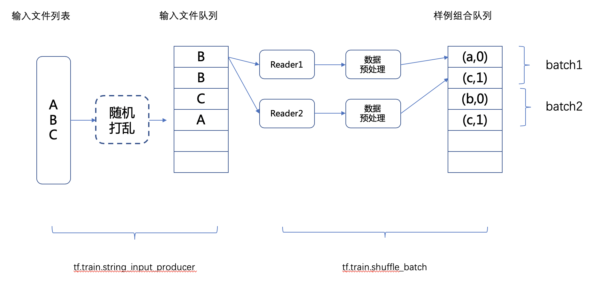

# tensorflow 数据预处理操作流程

## 1. 队列方式

### 1.1 队列

​	tensorflow 提供了两种队列的方式：tf.FIFOQueue 和 tf.RandomShuffleQueue；

1. tf.FIFOQueue 是先进先出队列；
2. tf.RandomShuffleQueue 是随机打乱输出队列，原理是从队列中随机选择一个元素进行输出；

### 1.2 线程

​	tensorflow 提供了 tf.Coondinator 和  tf.QueueRunner 两个类来完成多线程协同的功能。

1. tf.Coondinator：主要用于协同多个线程一起停止，提供了should_stop、request_stop 和  join 三个函数
2. tf.QueueRunner：主要用于启动多个线程来操作同一个队列，启动的线程可以通过 tf.Coondinator 来统一管理

### 1.3 输入文件队列

1. tf.train.match_filenames_once 函数是通过一个正则表达式获取一个文件列表；
2. tf.train.string_input_producer 函数是对上述函数获取的文件列表进行输入管理，通过使用文件列表创建一个输入队列，而输入队列中的原始元素为文件列表中的所有文件；也可以通过 shuffle 参数进行打乱

### 1.4 组合训练数据（batching）

1. tf.train.batch：也是一个队列，其负责将训练数据组合成一个 batch 后再输入模型进行训练，有两个参数：a、batch_size 训练计算的批次大小；b、capacity 队列的大小；
2. tf.train.shuffle_batch：大致功能跟 tf.train.batch 是一样的，但是有两点不同：a、支持 shuffle 参数，即打乱；b、设置 num_threads 参数，可以指定多个线程同时执行入队操作，但多个线程都读取同一个文件；
3.  tf.train.shuffle_batch_join：功能跟 tf.train.shuffle_batch  大致是一样的，但其多线程执行入队操作时，多线程各自读取一个文件，但如果线程数大于文件数多情况下，会存在多个线程读取一个文件；


### 1.5 总结队列方式的数据预处理流程

1. 通过 tf.train.match_filenames_once 函数获取文件列表；
2. 通过 tf.train.string_input_producer 函数将文件列表的文件输入文件名队列中；
3. 读取文件名队列文件内的内容并进行解析、预处理等操作，操作对象为一个训练样本；
4. 处理完的样本和样本标签形成元组，并放入 tf.train.shuffle_batch 中形成批次数据
5. 最后将批次数据输入模型，进行训练；



## 2. 高层方式：Dataset

​	Tensorflow 提供了一套更高层的数据处理框架，即 Dataset。在数据集框架中，每一个数据集代表一个数据来源；数据可能来自一个张量，一个 TFRecord 文件，一个文本文件，或者经过 sharding 的一系列文件。

1. 由于训练数据通常无法全部写入内存中，从数据集中读取数据时需要使用一个迭代器按顺序进行读取；与队列中的 dequeue 和 Reader 的 read 操作相似；
2. 数据集也是计算图上的一个节点。

### 2.1 利用数据集读取数据的三个基本步骤

1. 定义数据集的构造方法：
   - tf.data.Dataset.from_tensor_slices() ：从一个张量中构建数据集
   - tf.data.TextLineDataset(input_files)：从一个文本文件的列表读取文本文件；自然语言处理常用；
   - tf.data.TFRecordDataset(input_files)：从一个 TFRecord文件的列表读取文件，图像存在tfrecord中常用
2. 定义遍历器：
   - dataset.make_one_shot_iterator()：最简单的遍历器，使用前提是数据集的参数都是固定的；
   - dataset.make_initializable_iterator()：当数据集的参数文件路径是通过 placeholder 和 feed_dict 的方式传给数据集的情况下，就需要通过这个遍历器进行数据集的初始化和生成遍历器；
3. 使用 iterator.get_next() 方法从遍历器中读取数据张量，作为计算图其他部分的输入

### 2.2 Dataset 的高层操作

1. map 方法：是在数据集上进行操作的最常用的方法之一，返回参数仍然是一个数据集，可以直接继续调用其他高层操作

   ```python
   # 第一种调用方式：
   def parser(record):
     features = tf.parse_single_example(
       record,
       features = {
         'feat1': tf.FixedLenFeature([], tf.int64),
         'feat2': tf.FixedLenFeature([], tf.int64),
       })
     return features['feat1'], features['feat2']
   
   # map() 函数表示对数据集中的每一条数据进行调用相应的方法。
   dataset = dataset.map(parser)
   
   # 第二种调用方式：
   dataset = dataset.map(lambda x : preprocess_for_train(x, image_size, image_size, None))
   ```

2. shuffle 方法：打乱数据集内的顺序

   ```python
   # buffle_size：缓冲区大小，数据是在缓冲区进行打乱的
   dataset = dataset.shuffle(buffle_size)
   ```

   

3. batch 方法：将数据集内的数据组成batch

   ```python
   # batch_size: 形成的批次大小
   dataset = dataset.batch(batch_size)
   ```

   

4. repeat 方法：将数据集的内容重复加载几次

   ```python
   # N: 将数据集重复 N 份，即为 epoch
   dataset = dataset.repeat(N)
   ```

   备注：如果数据集中 repeat 前已经进行了 shuffle 操作，输出的每个 epoch 中随机 shuffle 的结果并不会相同。

