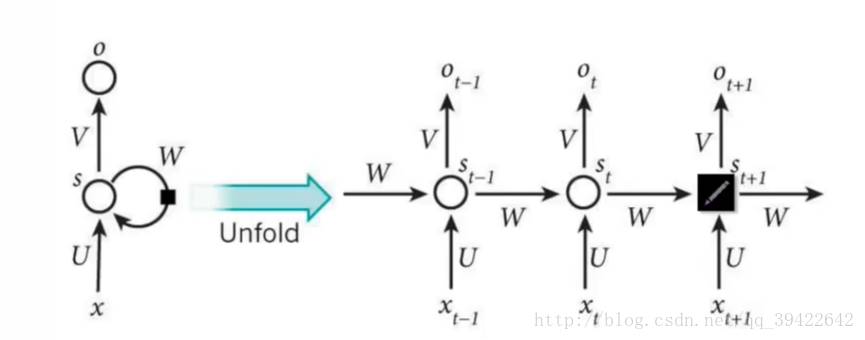
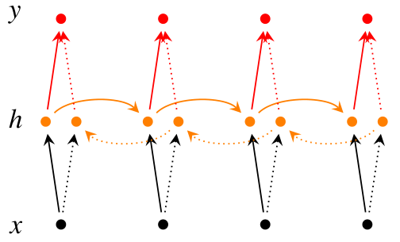
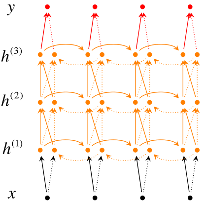
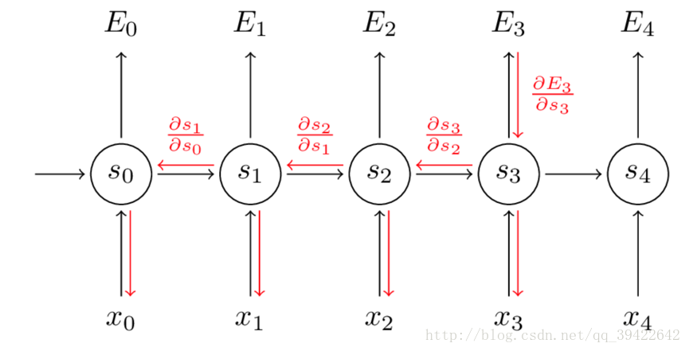

# 循环神经网络RNN知识点

## 定义

1. RNN 是一种特殊的神经网络结构，它是根据“人的认知是基于过往的经验和记忆”这一观点提出的。与DNN、CNN不同的是：它不仅考虑前一时刻的输入，而且赋予了网络对前面的内容的一种“记忆”功能。
2. RNN 之所以称为循环神经网络，即一个序列当前的输出与前面的输出也有关。具体的表现形式为网络会对前面的信息进行记忆并应用于当前输出的计算中，即隐藏层直接的节点不再无连接而是有连接的，并且隐藏层的输入不仅包括输入层的输出还包括上一时刻隐藏层的输出。
3. 与CNN、DNN的区别：无论是CNN，还是DNN，它们的前提假设都是：元素之间是相互独立的，输入与输出也是独立的。

## RNN 的网络结构与原理

它的网络结构如下：

​	其中每个圆圈可以看做是一个单元，而且每个单元做的事情也是一样的，因此可以折叠呈左半图的样子。用一句话解释RNN，就是一个单元结构重复使用。

**RNN中的结构细节**

1. 可以把可以把 St 当作隐状态，捕捉了之前时间点上的信息
2. ot 是由当前时间以及之前所有的记忆得到的
3. 很可惜的是，St 并不能捕捉之前所有时间点的信息
4. 和卷积神经网络一样，这里的网络中每个cell都共享了一组参数（U，V，W），这样就能极大的降低计算量了
5. ot 在很多情况下都是不存在的，因为很多任务，比如文本情感分析，都是只关注最后的结果的

## RNN 的改进

1. 双向 RNN

​	双向 RNN 需要的内存是单向 RNN 的两倍，因为在同一时间点，双向 RNN 需要保存两个方向上的权重参数，在分类的时候，需要同时输入两个隐藏层输出的信息。

2. 深层双向 RNN

   

## RNN 的反向传播

​	每一次的输出值Ot都会产生一个误差值Et, 则总的误差可以表示为：$E = \sum_{t} e_t$

则损失函数可以使用交叉熵损失函数，也可以使用平方误差损失函数。由于每一步的输出不仅仅依赖当前步的网络，并且还需要前若干步网络的状态，这种 BP 改版的算法叫做Backpropagation Through Time(**BPTT**) , 也就是将输出端的误差值反向传递,运用**梯度下降法**进行更新，具体如下：

