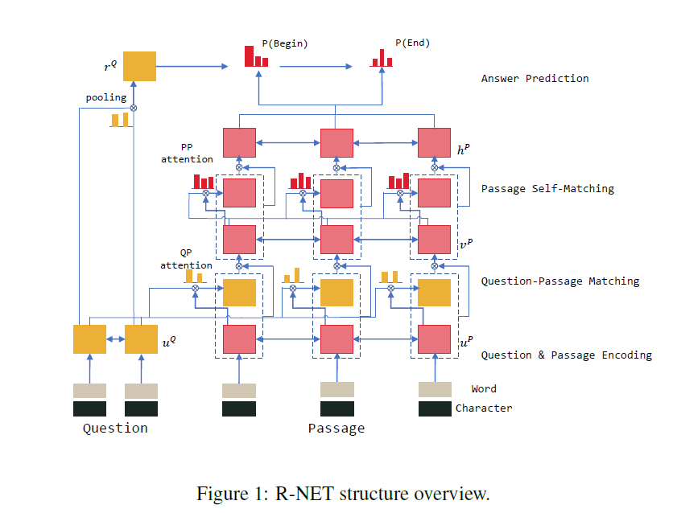
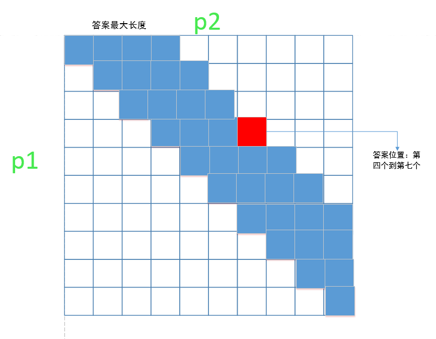

# 解读：R-net

R-Net 论文：https://www.microsoft.com/en-us/research/wp-content/uploads/2017/05/r-net.pdf

## R-net 结构图

​	R-NET模型一共分为四个步骤，分别为QUESTION AND PASSAGE ENCODER, GATED ATTENTION-BASED RECURRENT NETWORKS, SELF-MATCHING ATTENTION, OUTPUT LAYER, 基本结构可观察上面所示的结构图。

​	从直观上讲，R-Net 执行阅读理解的方式与你我进行阅读理解的方式相似：通过多次（准确地说是 3 次）「阅读」（应用 RNN）文本以及在每次迭代中越来越好地「微调」（使用注意力）各词的向量表征。

## 第一次阅读：略读

​	我们从标准的 token（即词）向量开始，使用了来自 Glove 的词嵌入。但是，人类通常理解一个词在其周围词所构成的语境中的含义。

​	比如这两个例子：「May happen」和「the fourth of May」，其中「May」的含义取决于周围的词。另外也要注意背景信息可以来自前向，也可以来自反向。因此，我们在标准词嵌入之上使用了 BiRNN，以得到更好的向量。问题和段落上都会应用这个过程。

​	第一层为表示学习过程。R-net中的方式 Input = glove + char embedding。第一种把文章P 和问题Q 的单词替换为 glove 词向量的数据；第二种是 char embedding ，最终把文章P 和问题Q 分别通过 BiRNN：
$$
u_t^Q = BiRNN_Q(u_{t-1}^Q, [e_t^Q, c_t^Q])
$$

$$
u_t^P = BiRNN_P(u_{t-1}^P, [e_t^P, c_t^P])
$$

## 第二次阅读：基于问题的分析

​	在第二次阅读中，该网络会使用文本本身的语境来调节来自段落的词表征。让我们假设你已经在该段落的重点位置了：

> 「……她非常擅长**制作**家庭手工工具、机械器具并且具有记忆塞尔维亚史诗的能力。久卡从没接受过正规教育……」

在有了「制作」的前提下，如果你在问题 token 上应用注意力，你可能会重点关注：

> 「特斯拉的母亲具有怎样的特殊**能力**？」

类似地，网络会调整「制作」的向量，使之与「能力」在语义上靠得更近。

​	该段落中的所有 token 都会完成这样的操作——本质上讲，R-Net 会在问题的需求和文章的相关部分之间形成链接。原论文将这个部分称为门控式基于注意力的 RNN（Gated Attention-based RNN）。

从上一层网络中可以得到u_Q 和 u_P，中这一层网络中R_NET试图把 u_Q 进行 attention 加权融入到 u_P 中，得到及问题 Q 意识下的文章语义理解 u_P:
$$
u_t^P = RNN(v_{t-1}^P, c_t)
$$
​	其中 $$c_t  = att(u^Q, [u_t^P, v_{t-1}^P])$$ 为对问题Q 的 attention-pooling 加权。从中可以看出$$c_t$$ 中的 attention 权重完全由文章中单词的含义 $$u_t^P$$ ，和上一个单词的问题下的理解 $$v_{t-1}^P$$ 决定：
$$
s_j^t = v^T tanh(W_u^Qu_j^Q + W_u^Pu_t^Q + W_v^Pv_{t-1}^P)
$$

$$
a_i^t = exp(s_i^t)/\sum_{j=1}^m exp(s_i^t)
$$

$$
c_t = \sum_{i=1}^m a_i^t u_i^Q
$$

​	R-net 又基于 matching-lstm 和门控制方式对以上方法提出两点改进，第一点是把$$c_t$$ 和 $$u_t^P$$ 加入RNN 中，即：
$$
v_t^P = RNN(v_{t-1}^P, [c_t, u_t^P])
$$
​	第二点又在$$[c_t, u_t^p]$$  上面加入门控制方式，为了更好地提取和文章有关的问题信息，即：
$$
g_t = sigmoid(W_g[c_t, u_t^P])
$$

$$
[c_t, u_t^p]^* = g_t \bigodot [c_t, u_t^p]
$$

## 第三次阅读：有自知的完整的段落理解

- 在第一次阅读过程中，我们在 token 临近周围词的语境中对这些 token 进行了理解。
- 在第二次阅读过程中，我们根据当前问题改善了我们的理解。

​	现在我们要鸟瞰整个段落，以定位那些对回答问题真正有帮助的部分。要做到这一点，光是有周围词的短期语境视角是不够的。考虑以下部分中突出强调的词：

> 特斯拉的母亲是久卡·特斯拉（娘家姓为 Mandić），她的父亲也是一位东正教神父；:10 她非常擅长制作家庭手工工具、机械器具并且具有记忆塞尔维亚史诗的**能力**。久卡从没接受过正规教育。尼古拉将自己的记忆和创造**能力**归功于他母亲的遗传和影响。

​	这都是指特斯拉的母亲所具有的能力。但是，尽管前者确实围绕描述该能力的文本（是我们想要的），但后面的能力则是将它们与特斯拉的才能关联了起来（不是我们想要的）。

​	为了定位答案的正确起始和结束位置（我们会在下一步解决这个问题），我们需要比较段落中具有相似含义的不同词，以便找到它们的差异之处。使用单纯的 RNN 是很难完成这个任务的，因为这些突出强调的词相距较远。

​	为了解决这个问题，R-Net 使用了所谓「自匹配注意力（Self-Matched Attention）」。

为什么需要自匹配？

​	在应用注意力时，我们通常会使用一些数据（比如一个段落词）来衡量一个向量（比如问题词）的集合。但在这个迭代过程中，我们会使用当前的段落词来衡量来自该段落本身的 token。这有助于我们将当前词与段落其余部分中具有相似含义的其它词区分开。为了增强这个过程，这个阅读阶段是使用一个 BiRNN 完成的。

​	在我看来，使用自匹配注意力这个步骤是 R-Net 最「神奇」的地方：使用注意力来比较同一段落中相距较远的词。

​	此过程充分借鉴了 Attention is all you need 中的自注意力思想，在模型效果提升中起了很大作用，而且这个方法也易于实现：
$$
h_t^P = BiRNN(h_{t-1}^P, [c_t, v_t^P])
$$
其中 $$c_t = att(v^P, v_t^P)$$ 是基于当前单词下的整篇文章的语义：
$$
s_j^t = v^Ttanh(W_v^Pv_j^P + W_v^pv_t^P)
$$

$$
a_i^t. = exp(s_i^t)/\sum_{j=1}^nexp(s_j^t)
$$

$$
c_t = \sum_{i=1}^na_i^tv_i^P
$$

## 最后一步：标记答案

​	在最后一步，R-Net 使用了一种指针网络（Pointer Networks）的变体来确定答案所处的起始和结束位置。简单来说：

​	我们首先根据问题文本计算另一个注意力向量。这被用作这一次迭代的「起始语境（starting context）」。使用这个知识，再为该起始索引计算一组权重（为该段落中的每个词）。得到最高权重的词作为其答案的「起始位置」。

​	除了权重之外，这个两步 RNN 还会返回一个新的语境——其中编码了有关该答案的起始的信息。

​	再将上述步骤重复一次——这一次使用新的语境而不是基于问题的语境，用以计算该答案的结束位置。

​	搞定！我们得到解答了！（实际上，我们上述例子中给出的答案就是 R-Net 实际得出的答案。）

​	R-NET模型输出的是答案在文章中的起始位置，在这一过程中借鉴了pointer-network的思想，R-NET模型先计算得到开始位置在文章中的分布$$p^1$$，再利用这一分布 $$p^2$$ 对整篇文章进行加权作为输入得到终止位置在文章中的分布 $$p^2$$。所以这其实是一个seq2seq的过程，只不过最终得到的seq中只有两项，即起始位置$$p^1$$和终止位置$$p^2$$。对于一个seq2seq过程，R-NET使用对问题 $$u_t^Q$$ 进行attention-pooling得到的 $$r^Q$$ 作为起始键。
$$
s_j = v^Ttanh(W_u^Qu_j^Q + W_v^Qv_r^Q)
$$

$$
a_i = exp(s_i)/\sum_{j=1}^mexp(s_j)
$$

$$
r^Q = \sum_{i=1}^na_iu_i^Q
$$

其中这个seq2seq的循环结构为：
$$
h_t^a = RNN(h_{t-1}^a, c_t)
$$
$$c_t$$ 依然是对文章的 attention-pooling 得到的结果：
$$
s_j^t = v^ttanh(W_h^Ph_j^P + W_h^ah_{t-1}^a)
$$

$$
a_i^t = exp(s_i^t)/\sum_{j=1}^nexp(s_j^t))
$$

$$
c_t = \sum_{i=1}^na_i^th_i^P
$$

​	不过再具体实验中还有一个小trick对提升效果很有用，由于我们得到了两个分布，，通过两个分布我们可以得到一个联合分布，在计算中可以表示为一个矩阵，然而由于开始位置永远在终止位置之前，所以我们的选择区域始终在矩阵对角线的左上半部分。又因为答案的长度有一定范围，我们可以设置答案的最大长度，所以最后的训责区域只是一个若当标准型矩阵的。

