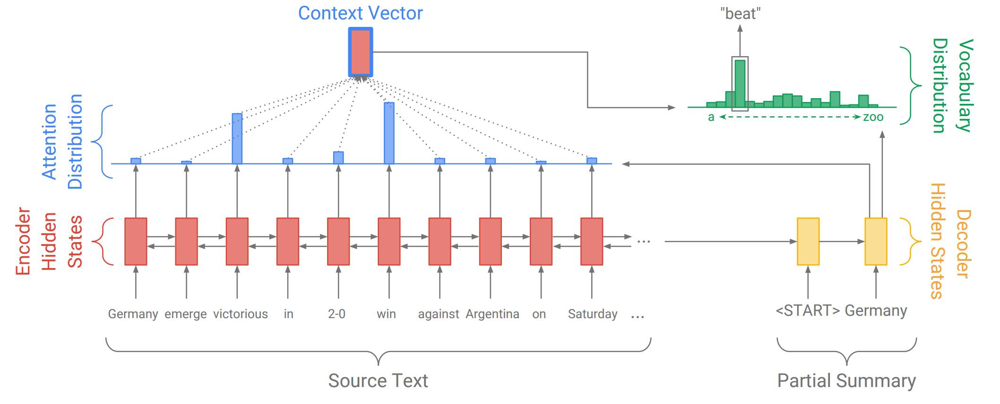
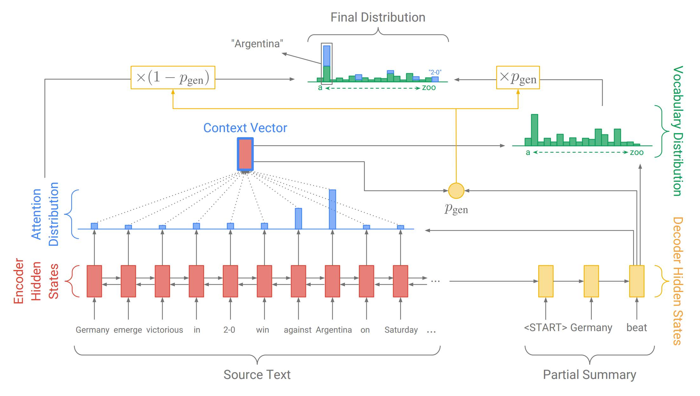
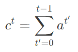

# 详解指针生成网络：自动生成长段文本的抽象摘要 

## 1. 两种类型的概括

一般而言，有两种自动文本摘要的方法：抽取式的的抽象式的。

- 抽取式的的方法会从源文本中选择一些段落，然后重新组织它们，以形成一段概括。你可以将这种方法想象成一支荧光笔。
- 抽象式的方法利用自然语言生成技术来写出原创的句子。用类似的比喻，这种方法就像一支钢笔。

​	现存的文本摘要的方法中，大部分都是抽取式的，主要是因为选择文本要比从零开始生成文本来得更加容易。例如，如果你用到的抽取式的方法涉及到了从源文本所有的句子中选择和重新组织，那么，你可以保证，生成的摘要是符合语法的、完全可读的，并且是和源文本相关的。被应用到中等长度的事实性文本中时，这些系统会比较成功，如新闻文章和技术性文档。

几个可以在线使用的抽取式文本摘要系统的链接如下：

- http://autosummarizer.com/
- http://textcompactor.com/
- http://smmry.com/

​	然而，另一方面，抽取式摘要的方法过于局限，它不能产生像人一样的文本总结，尤其是面对更长、更复杂的文本时。想象你试图仅仅通过选择和重新组织句子来为一部小说写出具有维基百科的风格的剧情简介，例如狄更斯的《远大前程》。这是不可能的。首先，《远大前程》是以第一人称写的，而剧情简介应该以第三人称来写。更重要的是，将一整章的内容压缩为一句话需要强大释义，这只在一个很抽象的框架下才是有可能的，例如「iPip 拜访了 Havisham 小姐，并且爱上了她的养女 Estella」。

简言之，抽象式摘要可能比较困难，但是它是很必要的！

## 2. 了解循环神经网络

​	如果你不熟悉循环神经网络和注意力（attention）机制，请查看 WildML（http://www.wildml.com/2015/09/recurrent-neural-networks-tutorial-part-1-introduction-to-rnns/）, Andrej Karpathy（http://karpathy.github.io/2015/05/21/rnn-effectiveness/）以及 Distill（http://distill.pub/2016/augmented-rnns/）的优秀教程。

​	近年来，循环神经网络（RNN）这种能够执行序列数据的计算（例如单词序列）的神经网络已经成为了许多自然语言处理任务的标准方法。特别地，如下图所示的具有 attention 的序列到序列（sequence-to-sequence）模型在文本摘要中已经变得流行。下面我们看着结构图逐步了解！

​	在这个例子中，我们的源文本是一片以「Germany emerge victorious in 2-0 win against Argentina on Saturday」开始的新闻文章，我们正在生成这样的摘要——「Germany beat Argentina 2-0」。首先，编码 RNN 逐词读取源文本，生成一个编码器隐藏状态的序列（因为我们的编码器是双向的，所以图中的序列有两个方向的箭头。不过，在这里并不重要）。

​	当编码器读取整个源文本之后，解码 RNN 开始输出应该形成文本摘要的单词序列。在每一步，解码器将摘要中之前的单词作为输入（在第一步，特定的<START>标志作为写作开始的信号），并用它们来更新解码器的隐藏状态。解码器隐藏状态被用来计算注意力分布，注意力分布是源文本中所有单词的概率分布。直观地说，注意力分布告诉网络「应该看哪里」，以帮助网络生成下一个单词。在上图中，解码器目前生成了第一个单词Germany，并且专注于源文本中的 win 和 victorious，以生成下一个单词 beat。

​	然后，注意力分布被用来生成一个编码器隐藏状态的加权和，它被称作语境向量 (context vector)。语境向量可以被视为解码器在这一步骤中「从源文本中看到的东西」。最后，语境向量和解码器隐藏状态被用来计算出词汇分布，它就是在一个通常为成千上百这么大的固定词汇集合中的概率分布。最大概率的单词将会被选为输出（在这一步中，被选中的是 beat），然后，解码器开始下一个步骤。

​	解码器的这种以任意顺序自由地生成包括像 beat 这种并未出现在源文本中的单词的能力，使得序列到序列的模型在抽象式摘要中成为一个很有潜力、强大的解决方案。

## 3. 两大问题

不幸的是，用这种方法进行文本摘要时会被两大问题困扰：

- 问题 1：有时候这种摘要会不准确地复制事实细节（例如，Germany beat Argentina 3-2）。这对像「2-0」这种罕见的或者词汇集之外的词来说尤其常见。
- 问题 2：有时候摘要会重复它们本身（例如，Germany beat Germany beat Germany beat…...）

​	事实上，这种问题对循环神经网络而言是很常见的。在深度学习中总是这样，很难去解释清楚为什么网络会出现一些特殊的行为。如果你感兴趣，请看下面我对这两个问题做出的解释。如果你对这两个问题的原因不感兴趣，请直接跳到后文的解决方案部分（即用指针生成网络来实现更加容易的复制）。

​	对问题 1 的解释：基于 attention 的端到端模型让从源文本中复制一个单词 w（w 即 word，代表一个单词）变得更加困难。在接收到经过几个层的计算（这些计算包括将单词 w 与它的 word embedding 进行匹配）才传递过来的信息之后，网络必须以某种方式去恢复原始单词。

​	尤其是，如果 w 是那些在训练的时候不经常出现的罕见词汇，并且有着较差的 word embedding（即它与完全不相关的单词聚集在一起），那么，从网络的角度来说，w 在很多单词中是无法无分的，所以也就不可能被生成。

​	即便 w 有着较好的 word embedding，网络也可能仍然很难去生成它。例如，RNN 摘要系统经常将一个人名替换成另一个人名（例如 Anna → Emily），或者将一个城市替换为另一个城市（例如，Delhi → Mumbai）。这是因为女性的名字或者印度的城市名的 word embeddings 倾向于聚集在一起, 在尝试重建原始单词的时候，这可能造成混淆。

​	简而言之，这貌似是执行一个简单的复制（copying）操作的不必要的困难方式，复制操作是摘要任务中的基本操作。

​	对问题 2 的解释：重复或许是由解码器对输入（即之前的摘要单词）的过度依赖造成的，而非解码器状态存储了长时间的信息。这可以通过以下事实来看出：单个重复的单词通常触发无休止的循环。例如，Germany beat Germany这么一个微小的错误会导致灾难性的 Germany beat Germany beat Germany beat Germany beat…...，而不是错误不太严重的 Germany beat Germany 2-0。

## 4. 指针网络如何解决上述两个问题

### 4.1 用指针生成网络来实现更加容易的复制（解决问题 1）

​	我们针对问题 1（不准确复制）的解决方案是指针生成网络。这是一个可以通过指针从源文本中选择复制单词的混合网络，同时还保留了从固定词汇集中生成单词的能力。下面我们以这张图进行逐步解释！

​	上图展示了解码器的第三步，截至目前我们已经生成了一部分摘要 Germany beat。和之前一样，我们计算出注意力分布和词汇分布。然而，这次我们还计算出了生成概率 pgen(此处公式、符号不好展示，具体参见原文)，它是介于 0 到 1 之间的标量。它代表从词汇集中生成一个单词的概率，而不是从源文本进行复制。生成概率pgen 被用来对词汇分布Pvocab(用来生成单词) 和注意力分布 aa（用来指向元单词 w_iwi）进行加权，并通过如下所示的公式将两者结合成最终分布 Pfinal，结合公式如下所示：
$$
P_{final}(w) = p_{gen}P_{vocab}(w) + (1-P_{gen})\sum_{i:w_i=w}a_i
$$
​	这个公式的含义是：生成单词 w 的概率等于从词汇集生成 w 的概率再加上指向原文本任何位置出现该词的概率。

与基于 attention 的端到端系统相比，指针生成网络具有以下优点：

1. 指针生成网络让从源文本生成单词变得更加容易。这个网络仅需要将足够多的 attention 集中在相关的单词上，并且让pgen 足够的大。

2. 指针生成网络甚至可以复制原文本中的非正式单词（如例子中的 2-0）。这是此方法带给我我们的主要福利，让我们能够处理那些没出现过的单词，同时也允许我们使用更小规模的词汇集（需要较少的计算资源和存储空间）。

3. 指针生成网络能够被更快地训练，尤其是训练的前几个阶段。

如此一来，指针生成网络就是两种方法中最好的，它用指向（pointing）和生成（generating）把抽取式摘要和抽象式摘要结合起来了。

### 4.2 用汇聚的方法来消除重复（解决问题 2）

为了解决问题 2（重复性摘要），我们采用了一种叫做汇聚（Coverage）的技术。其思想就是，利用注意力分布区追踪目前应被覆盖的单词，并且当网络再次注意同一部分的时候，予以惩罚。在解码器的每一个时间步长 t 上，汇聚向量 ct 是截至目前所有的注意力分布 at'的和。如下式所示：

换言之，某个特定的源单词的收敛就是到此刻它所受到 attention 的和。在我们运行的例子中，汇聚可以按照这种方式来构建：其中，黄色阴影的强度代表汇聚向量的大小。

最后，我们引入额外的损失项来惩罚汇聚向量 c't 和新的注意力分布 a't 之间的任何交叠：如下所示：
$$
covloss_t = \sum_{i}min(a^t_i, c^t_i)
$$
这样可以避免网络继续重视（从而摘录）那些已经被覆盖到的词汇。

## 5. 输出示例

​	现在，我们来看一下上述几个系统在一些实际数据上的对照试验。我们在 CNN/Daily Mail 数据集上训练并测试我们的网络，这个数据集包含配以多句式摘要的新闻文章。

​	下面的例子展示的是源文本（关于英式橄榄球的新闻文章）和原本就有的参考摘要，以及由我们的三个系统所生成的自动摘要。通过将光标悬停在自动摘要系统生成的摘要中的一个单词上边，你会在源文本中看到注意力分布被投影成了黄色。这告诉你，当网络生成这个词的时候，它正在「注意」源文本中的那个词。

​	对于指针生成模型，生成概率 pgen 的值也被投影成了绿色阴影。将光标悬停在自动摘要文本中的某一个单词上时，会显示出这个单词对应的生成概率 pgen 的大小。

注意：为了看到整个 demo 的全貌，你可能需要缩小你的浏览器窗口。但是在移动端，demo 不会有效果。