# 长短时记忆网络LSTM知识点

## 普通的 RNN 存在的问题

​	普通的 RNN 没有办法解决需要长时间记忆的功能。比如试图预测“I grew up in France… I speak fluent French.”中最后一个词，展示如下图：

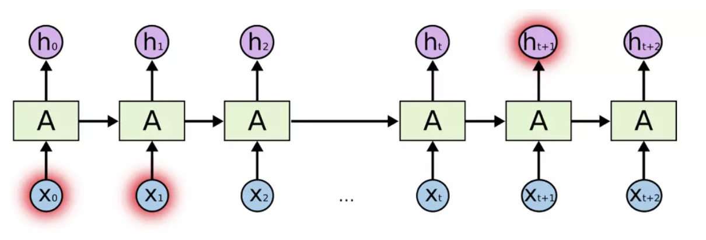

## LSTM 定义

​	LSTM 是一种特殊的 RNN，可以解决长短时的时间序列问题。与普通 RNN 对比如下，**普通 RNN** 为：

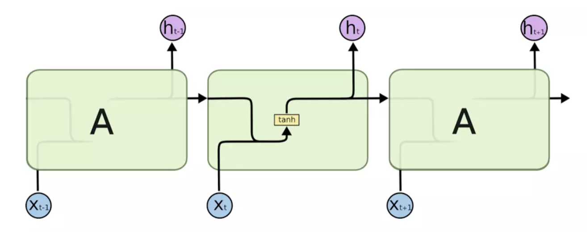

LSTM 内部结构如下：

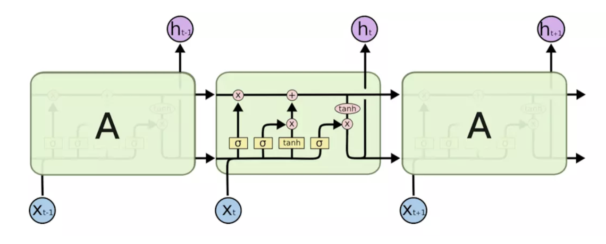

接着说明解释一下内部四个网络的具体意义，主要分为：单元状态 + 门限：

### 单元状态

​	单元状态：让信息以不变的方式向下流动，相当于一个传送带，但传送带上的东西会随着他通过每一个重复模块基于当时的输入有所增减。

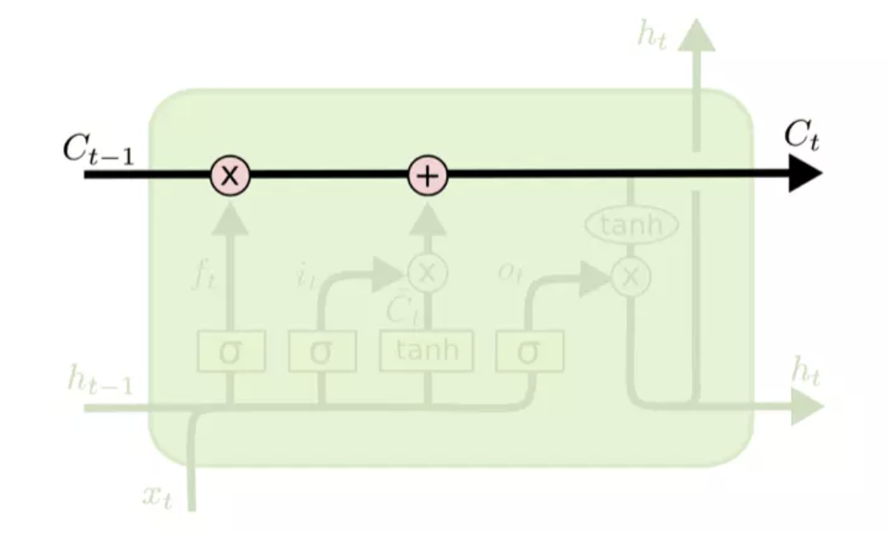

### 门限

​	门限：有能力向单元状态增加或者剔除信息的管理机构，相当于传送带上放东西或者拿走东西的那个人。在LSTM中由sigmoid函数和乘法加法来控制这个过程。

#### 1. 遗忘门限层

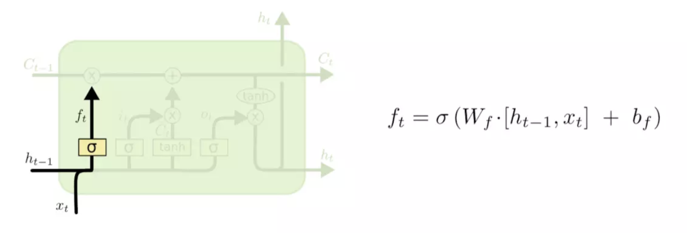

​	上图通过当前时间的输入和前一个时间的输出来通过 sigmoid 函数来是的单元状态乘以这个 sigmoid 函数的输出。若 sigmoid 函数输出 0 则该部分信息需要被遗忘，反之该部分信息继续在单元状态中继续传下去。

#### 2. 输入门限层

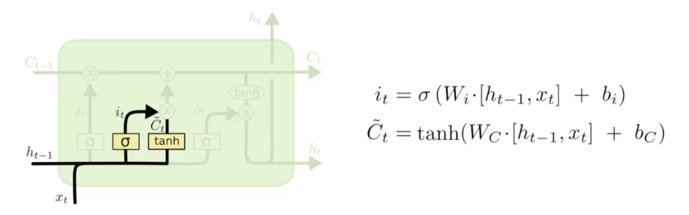

​	该门限功能是更新旧的单元状态。之前的遗忘门限层决定了遗忘或者添加哪些信息，由该门限层来执行实现

#### 3. 更新门限层

​	下面将更新旧的细胞信息 $C_{t-1}$ ，变为新的细胞信息 $C_{t}$ 。更新的规则就是通过忘记门选择忘记旧细胞信息的一部分，通过输入门选择添加候选细胞信息 $\tilde C_{t}$ 的一部分得到新的细胞信息 $C_{t}$ 。更新操作如下图所示:

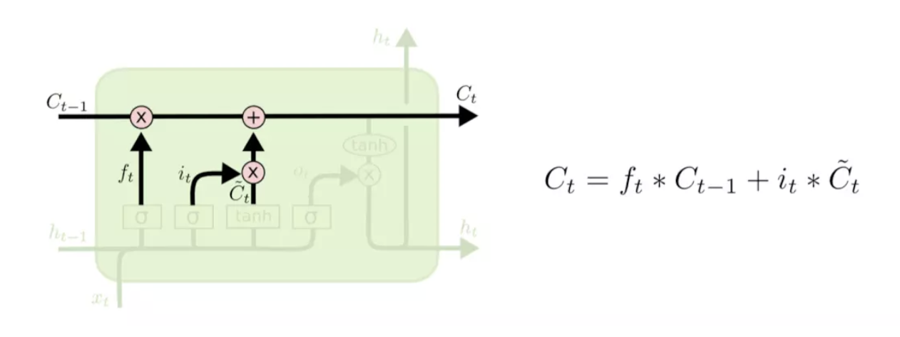

#### 4. 输出门限层

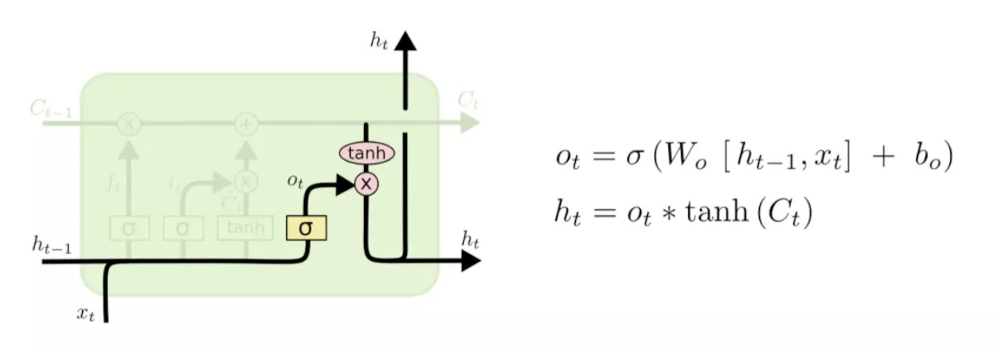

​	最后，我们需要决定需要输出什么。这个输出将会建立在单元状态的基础上，但是个过滤版本。首先，我们运行一个 sigmoid 层来决定单元状态中哪些部分需要输出。然后跟我们将单元状态输入到 tanh 函数（将值转换成 -1 到 1 之间）中，然后乘以输出的 sigmoid 门限值，所以我们只输出了我们想要输出的那部分。

## 变形的 LSTM 网络

### 1. 窥视孔连接 LSTM

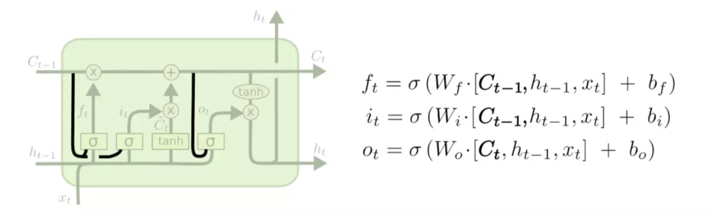

​	一种流行的LSTM变种，由[Gers和Schmidhuber （2000）](https://link.jianshu.com/?t=ftp://ftp.idsia.ch/pub/juergen/TimeCount-IJCNN2000.pdf)提出，加入了“窥视孔连接”（peephole connections）。这意味着门限层也将单元状态作为输入。

### 2. 耦合遗忘输入门限的 LSTM

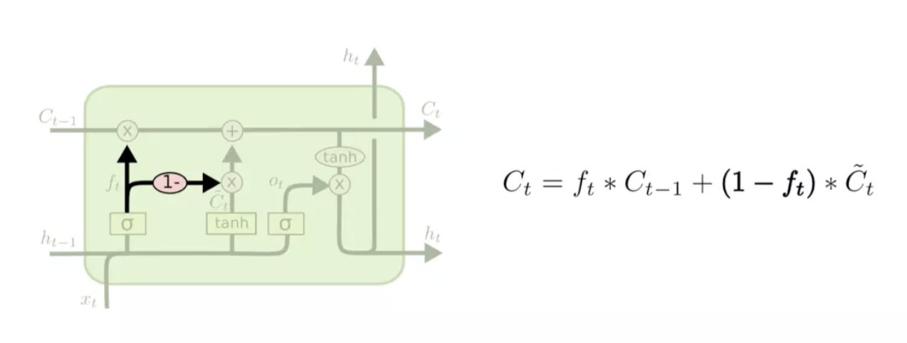

​	就是使用耦合遗忘和输入门限。我们不单独决定遗忘哪些、添加哪些新信息，而是一起做出决定。在输入的时候才进行遗忘。在遗忘某些旧信息时才将新值添加到状态中。

### 3. 门限递归单元

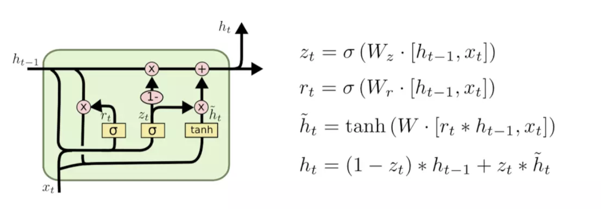

​	它将遗忘和输入门限结合输入到单个“更新门限”中。同样还将单元状态和隐藏状态合并，并做出一些其他变化。所得模型比标准LSTM模型要简单，这种做法越来越流行。

